[← Оглавление](README.md)

# 02. Шапка

Компонент `E-Com header` — `22988:20363`, **22 варианта**. Инстанс, который стоит на страницах: `22988:40786` (`Desktop header/E-com`).

---

## Десктоп — базовое состояние

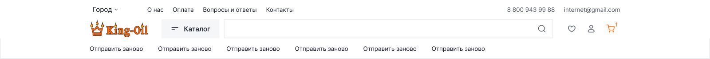

Высота **160 px**, три ряда.

### Ряд 1 — топ-бар (0–52)

| Элемент | X | Ширина | Высота |
|---|---|---|---|
| Выбор города (дропдаун `Text & icon dropdowns`) | 240 | 90 | 32 |
| Меню: О нас / Оплата / Вопросы и ответы / Контакты | 394 | 393 | 24 |
| Телефон 8 800 943 99 88 | 1357 | 128 | 24 |
| E-mail | 1509 | 151 | 24 |

Текст — `Small r` 16/24, цвет `--ko-text-2`. Правый блок заканчивается на 1660 = 1900 − 240.

### Ряд 2 — основной (52–104)

| Элемент | X | Ширина | Высота |
|---|---|---|---|
| Логотип King-Oil | 240 | 160 | 52 |
| Кнопка «Каталог» (`Catalog btn`) | 432 | 155 | 52 |
| Поисковая строка (`Base input`) | 599 | 881 | 52 |
| Иконки: избранное / ЛК / корзина | 1504 | 3 × 52 | 52 |

Иконки — компонент `Header btn` (`2099:58391`), 52×52 на десктопе, 48×48 на мобайле. Иконка корзины окрашена в `--ko-icon-brand`, у неё бейдж-счётчик в правом верхнем углу.

### Ряд 3 — категории (104–160)

Слот высотой 56. Пункты — `Text btn`, шаг **183 px**, ширина 143, высота 24, верхний отступ 16.

⚠️ В самом компоненте лежит 6 пунктов-плейсхолдеров с текстом «Отправить заново». На страницах их 8: Моторные масла / Трансмиссионные / Антифриз / Аккумуляторы / Фильтры / Лампы / Акции / Контакты. Верстаем по страницам, а не по компоненту.

---

## Десктоп — остальные состояния

### Закреплённая шапка при скролле — 1900×72

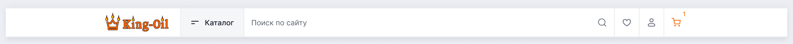

Схлопывается в один ряд: логотип, «Каталог», поиск с плейсхолдером «Поиск по сайту», иконки. Топ-бар и ряд категорий скрываются.

### Активный поиск

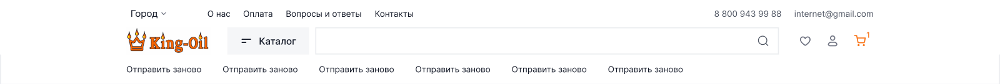

### Раскрытое мега-меню каталога — 1900×960

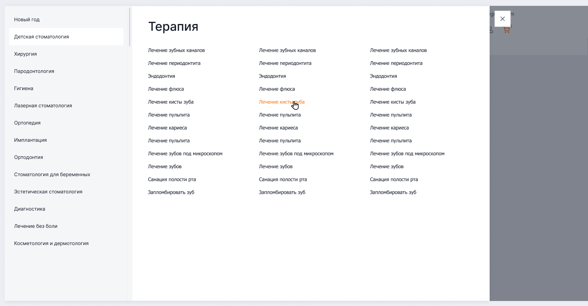

Компонент `Component 148/Menu list` (`22988:21416`), кадр на главной — `26900:23600`.

Панель **1580×960 от левого края, поверх шапки**, не на всю ширину. Справа от неё крестик
`52×52` на белом фоне (x=1596, y=16). За панелью — затемнение на всю ширину, шапка тоже
уходит под него.

- Левая колонка **400** на подложке `--ko-bg-1`, паддинг 16 (справа 12). Пункт `372×56`,
  без гэпа между пунктами, активный — **белая** плашка. Между колонками полоса прокрутки 16.
- Правая часть **1164** белая: заголовок H3 48/52 на (52, 40), ниже три колонки ссылок по
  337.33 с гэпом 24, шаг строки 42 (ссылка 16/24, hover — оранжевый).

⚠️ Контент этого варианта — из чужого проекта (стоматология). Структуру берём, тексты — из реального каталога.

### Пустая корзина / пустое избранное

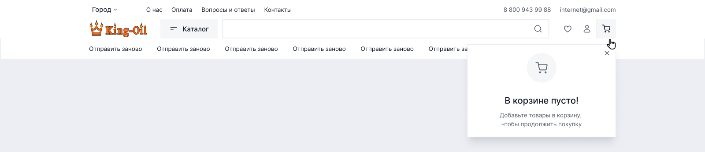
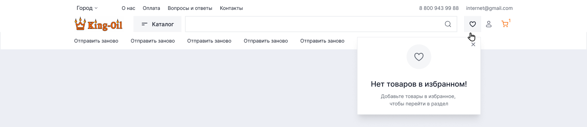

Мини-модалка 400×252 выпадает под иконкой.

**Сделано 10 сентября.** Обе мини-модалки собраны, счётчики на иконках считаются от
корзины и избранного. Клик по иконке при пустом состоянии открывает модалку, а не уводит
на страницу. Заодно компонент пересверен по Figma и приведён к макету — было 400×220
и 400×318. См. [26-logic-pass.md](26-logic-pass.md).

### Личный кабинет — гость и авторизованный

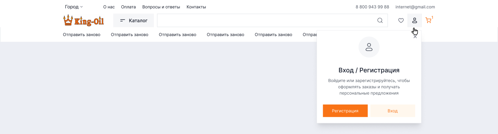
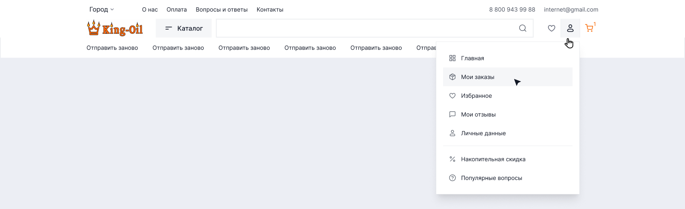

Гость — мини-модалка 400×356 с кнопками «Регистрация» / «Вход».
Авторизованный — меню 400×424: Главная, Мои заказы, Избранное, Мои отзывы, Личные данные, разделитель, Накопительная скидка, Популярные вопросы.

---

## Выпадающий поиск

Компонент `Search list` — `1910:15207`, 6 вариантов: `State 1/2/3` × `E-com / Corporate`. Ширина панели 960 (в шапке используется 881 по ширине инпута).

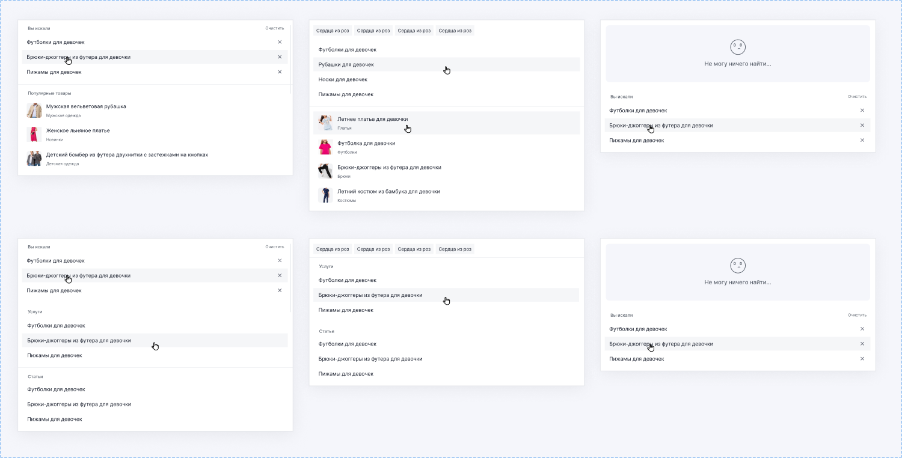

| Состояние | Что показывает |
|---|---|
| State 1 | «Вы искали» — история запросов с крестиками + «Очистить», ниже «Популярные товары» с миниатюрами |
| State 2 | Подсказки: чипы популярных запросов сверху, затем список текстовых подсказок и товары с миниатюрами и категорией |
| State 3 | «Не могу ничего найти» + история запросов |

Вариант `Corporate` отличается группировкой (разделы «Услуги» и «Статьи» вместо товаров). Для магазина берём **E-com**.

⚠️ Демо-контент — детская одежда. Структуру берём, данные подставляем свои.

---

## Мобайл (375 px)

| Состояние | Скриншот |
|---|---|
| Базовая шапка | 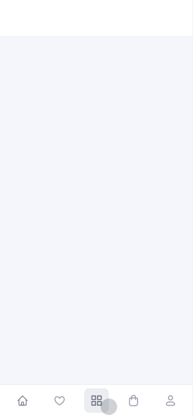 |
| Каталог — плитка | 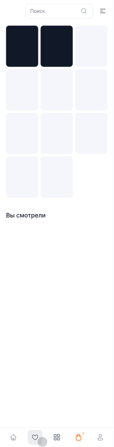 |
| Каталог — список | 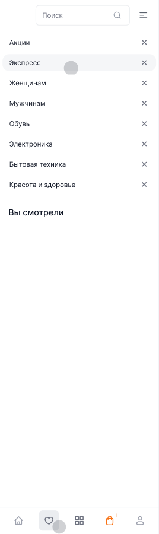 |
| Подраздел каталога | 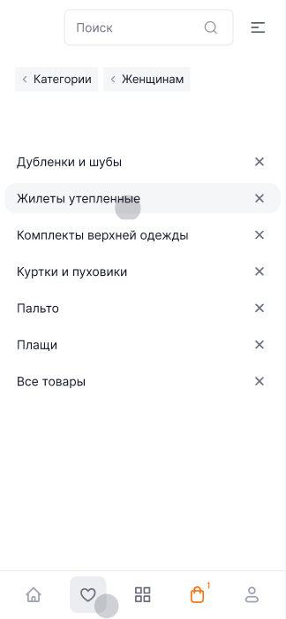 |
| Меню (бургер) | 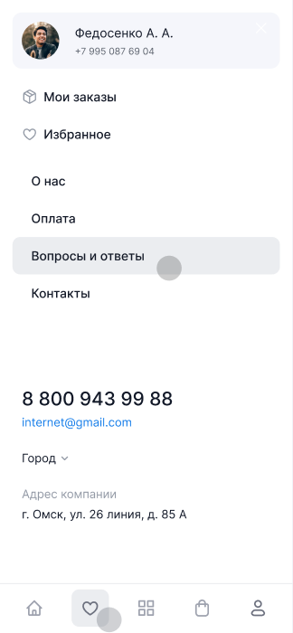 |
| Выбор города | 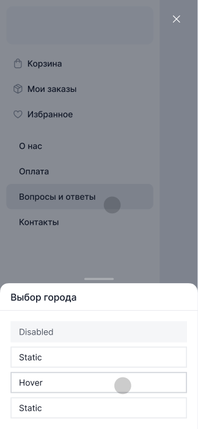 |
| Поиск | 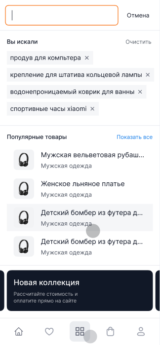 |
| Поиск — процесс | 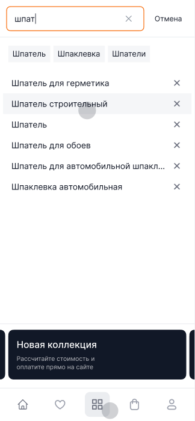 |
| Поиск — ничего не найдено | 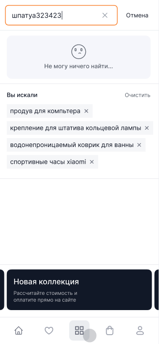 |
| Вход в аккаунт | 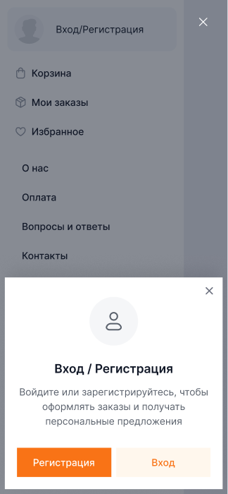 |

Всего 14 мобильных вариантов; выше — 10 ключевых. Оставшиеся (`Menu` ещё в двух видах, `Empty basket`, `Favorites are empty`) — того же паттерна.

**Меню** содержит: карточку пользователя с аватаром, «Мои заказы», «Избранное», разделитель, О нас / Оплата / Вопросы и ответы / Контакты, телефон, e-mail, выбор города, адрес компании.

**Таббар** (`Tabbar`, `1910:8134`, 5 вариантов) — фиксированная нижняя панель 376×64 с пятью иконками: главная, избранное, каталог, корзина, профиль. Активная подсвечена `--ko-bg-1`, у корзины бейдж.

---

## Поведение, которое нужно заложить

1. При скролле вниз шапка схлопывается в sticky-вариант 72 px.
2. Кнопка «Каталог» имеет состояние Hover (`Catalog btn`: Static / Hover) и открывает мега-меню с затемнением фона.
3. Клик по избранному / корзине / ЛК при пустом или неавторизованном состоянии открывает мини-модалку, а не переход на страницу.
4. Поиск открывает выпадающую панель уже при фокусе (State 1 — история), а не только после ввода.
5. На мобильном вместо шапки-меню работает таббар снизу + бургер.

## Верхний ряд шапки (7 сентября 2026)

- Ряд ссылок выровнен по левому краю кнопки «Каталог» (логотип 160 + отступ 20 + гэп 12):
  блоку города задана эта ширина, `margin-left` у навигации снят.
- Ссылки верхнего ряда — вторичного цвета `--ko-text-2`, «Бонусные баллы» остаётся
  акцентной, наведение — оранжевый.
- Пункт «Вопросы и ответы» заменён на «Отзывы» (`reviews.html`) — и в десктопной шапке,
  и в мобильном меню.

## Крестик мини-модалки (8 сентября 2026)

Кнопка `.mini-modal__close` — 24×24 в правом верхнем углу, отступы 12/12. Иконке внутри
обязательно нужен явный размер (`.mini-modal__close svg { width: 100%; height: 100% }`):
без него `<svg>` берёт холст по умолчанию 300×150, вылезает за кнопку, и крестик визуально
съезжает вниз — на уровень круглой иконки. Замер после правки: иконка 24×24, отступы
12 сверху и 12 справа на 1024 / 1440 / 1900.
