[← Оглавление](README.md)

# 03. Модальные окна

Фрейм `1. Modals` — `26844:17563`. Всего ~88 состояний.

## Общие правила

| Параметр | Десктоп | Мобайл |
|---|---|---|
| Ширина окна | **512 px** (компактные — 450 или 400) | **359 px** |
| Радиус | 0 | 0 |
| Фон | `--ko-bg-0` | `--ko-bg-0` |
| Затемнение фона | `Затемнение фона` `22924:23781`, Desktop 1920×960 / Mobile 375×812 | |
| Заголовок | `Heading 5` 32/38 | ~24 |
| Крестик закрытия | 24×24, правый верхний угол | |

**Поля ввода:** фон `--ko-bg-1`, рамка `--ko-border-1`, паддинг 14/16. В фокусе — рамка `--ko-border-brand`. При ошибке — фон `--ko-bg-error`, рамка `--ko-border-error`, под полем подпись `Caption` цветом `#ee443f`. Пароли — с иконкой «глаз»: 24×24, справа 18, по центру инпута (`Base input` 2099:53478). Скрытый пароль — `i-eye`, открытый — перечёркнутый `i-eye-off` (State=2, `2099:53466`).

**Ошибка у чекбокса** подписи не имеет: помечается сам квадрат рамкой и фоном ошибки — подпись попадала в 18-пиксельную колонку сетки и ломалась по букве. См. [26-logic-pass.md](26-logic-pass.md).

**Кнопки:** в столбик, первичная оранжевая сверху, вторичная серая под ней, гэп 8–12.

⚠️ Во всех заголовках стоит плейсхолдер: «Вход в \_\_\_\_\_», «Регистрация в \_\_\_\_\_». Название магазина нужно подставить.

---

## Авторизация — `2099:49348`, 6 состояний × 2

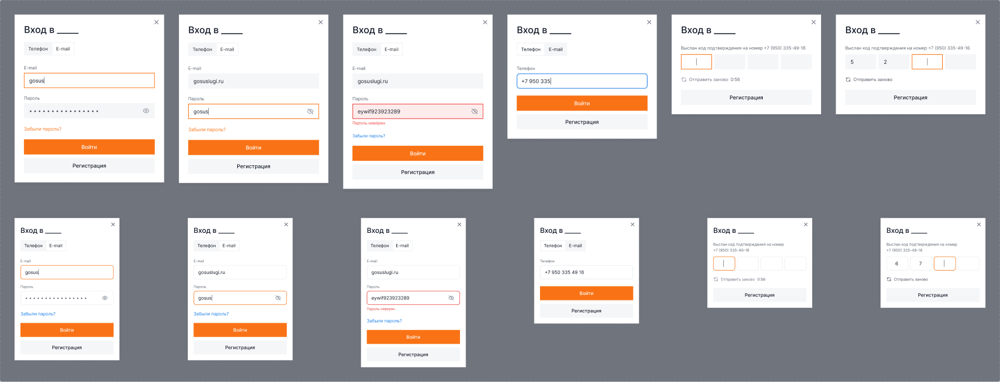

1. Таб «Телефон / E-mail», поле e-mail, поле пароля, ссылка «Забыли пароль?», кнопки «Войти» / «Регистрация»
2. Пароль в открытом виде (нажат «глаз»)
3. Ошибка: «Пароль неверен» — красное поле
4. Вход по телефону: поле `+7 950 335…`
5. Выслан код: 4 ячейки ввода, таймер «Отправить заново 0:56»
6. Код введён частично, таймер истёк — «Отправить заново» активна

---

## Регистрация — `2099:53725`, 5 состояний × 2

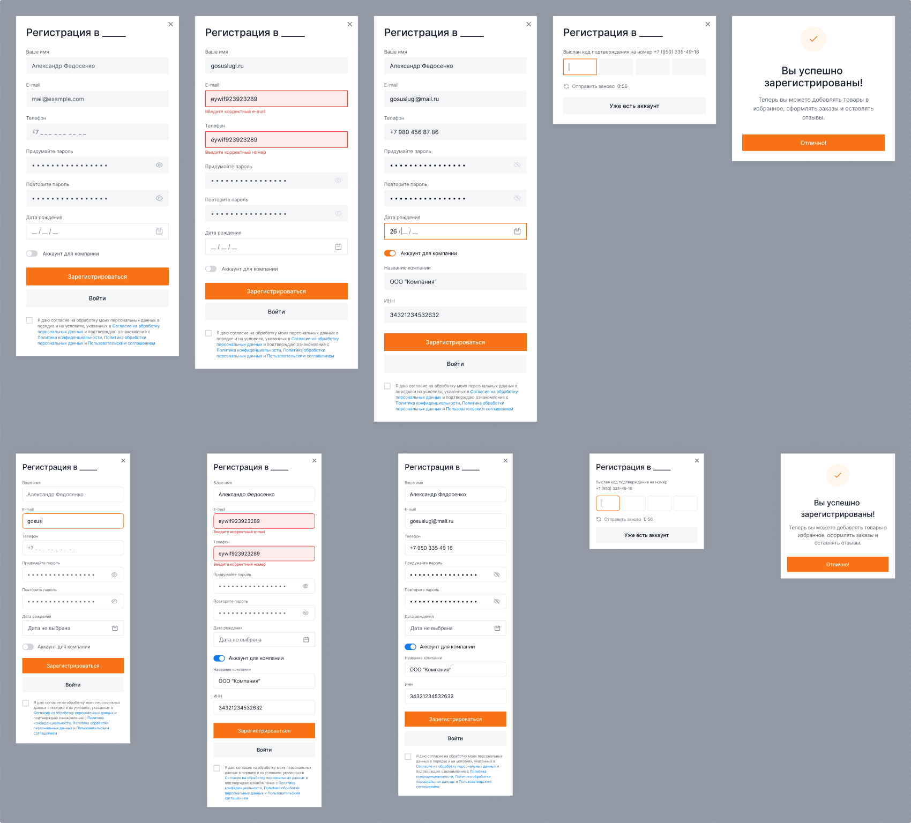

Поля: Ваше имя, E-mail, Телефон, Придумайте пароль, Повторите пароль, Дата рождения (с иконкой календаря), тумблер **«Аккаунт для компании»**.

При включённом тумблере появляются: «Название компании» и «ИНН».

Внизу — чекбокс согласия на обработку персональных данных со ссылками (Согласие на обработку ПД, Политика конфиденциальности, Политика обработки ПД, Пользовательское соглашение).

Состояния: пустая форма → ошибки валидации e-mail и телефона → заполненная с юрлицом → ввод кода подтверждения → «Вы успешно зарегистрированы!» с кнопкой «Отлично!».

---

## Восстановление пароля — `3832:86425`, 5 × 2

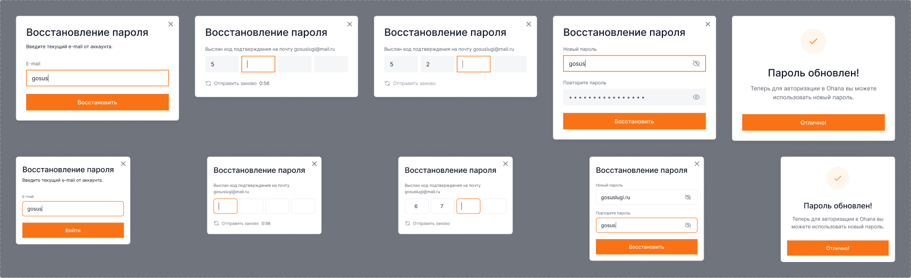

## Изменение пароля — `4136:84095`, 5 × 2

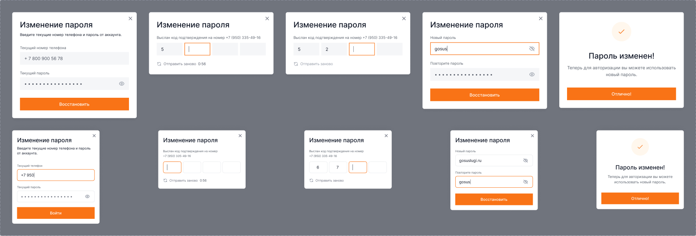

Текущий телефон + текущий пароль → код из SMS (4 ячейки) → новый пароль + повтор → «Пароль изменён!».

⚠️ Кнопка на шаге ввода нового пароля подписана «Восстановить», хотя сценарий — изменение. Уточнить у дизайнера.

## Изменение e-mail — `4136:44201`, 5 × 2

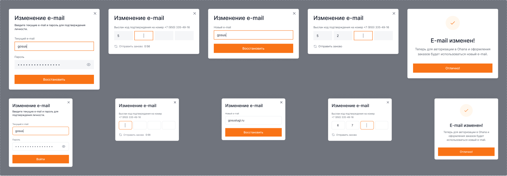

## Изменение номера телефона — `4136:83741`, 6 × 2

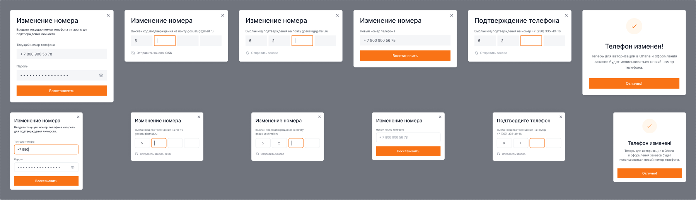

## Изменение профиля — `4163:133053`, 2 × 2

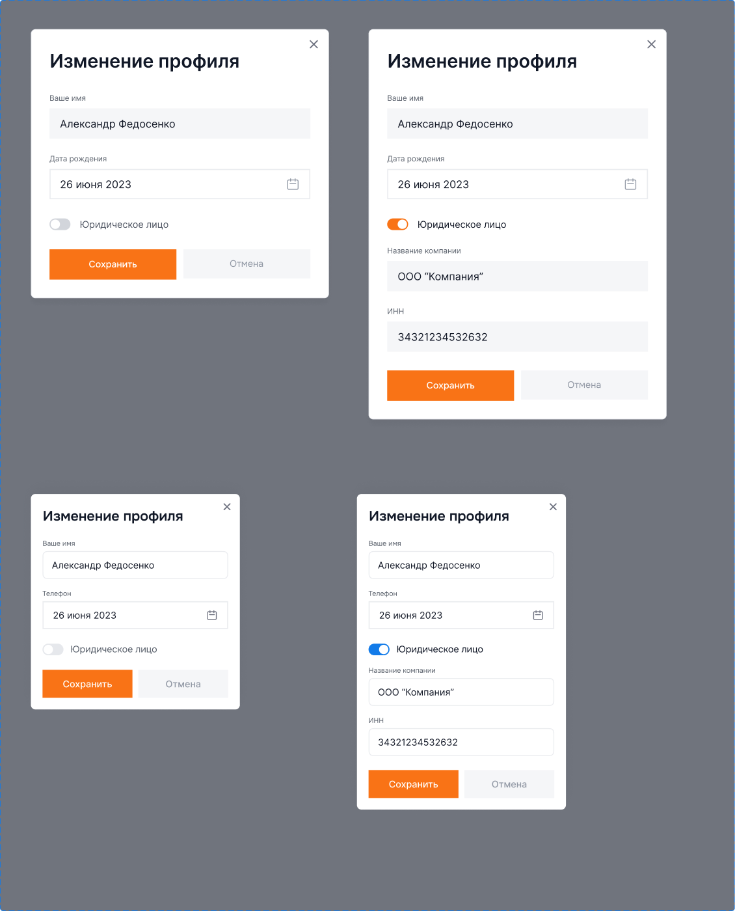

Варианты `Legal person = No` (512×462) и `Legal person = Yes` (512×670 — добавляются поля юрлица).

---

## Компактные модалки

### Вход для действия — `2149:59392`, 2 варианта (450×404 / 359×370)

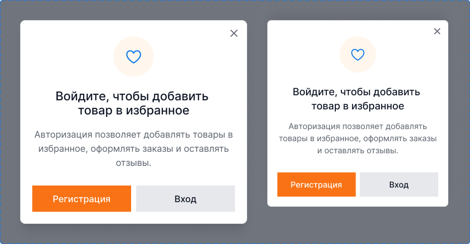

«Войдите, чтобы добавить товар в избранное». Круглая подложка иконки (`radius-max`) с фоном `#fff4e6`, кнопки «Регистрация» (оранжевая) и «Вход» (серая) в один ряд по 50 %.

### Ошибка — `14007:43249`, 2 варианта (450×344)

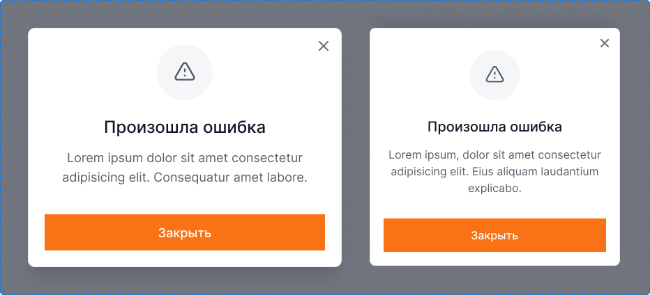

### Информация — `14007:43166`, 2 варианта (450×232)

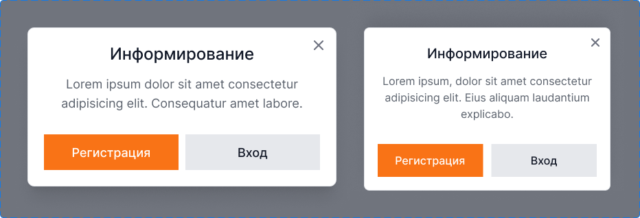

### Мини-модалки шапки — `2099:57024`, 5 вариантов

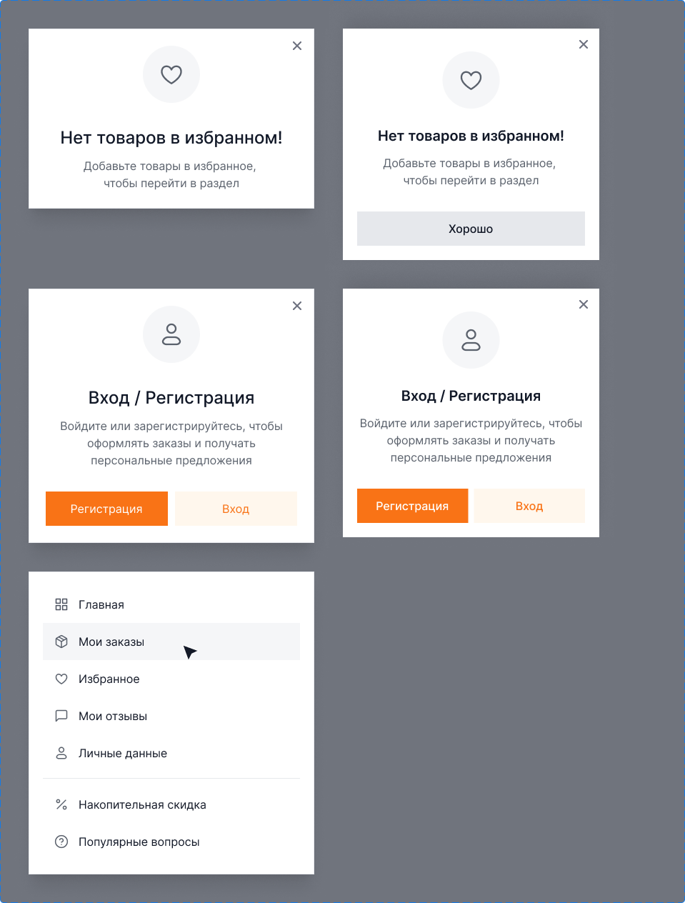

`Fav` 400×252 (desktop) / 359×324 (mobile), `Login` 400×356 / 359×348, `Profile` 400×424.
На мобильном у этих модалок добавляется кнопка «Хорошо» / «Закрыть» на всю ширину.

### Пустая корзина — `4152:115864`, 2 варианта

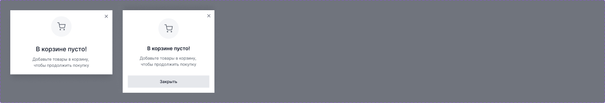

---

## Формы-заявки (Basic form)

Три набора одного компонента:

| Набор | Node | Состояний | Назначение |
|---|---|---|---|
| «Нашли дешевле» | `22988:19385` | 3 × 2 | форма + раскрывающийся блок «Условия акции» |
| «Заказать звонок» | `22924:23657` | 2 × 2 | короткая форма |
| третий вариант | `22924:23716` | 2 × 2 | форма среднего размера |

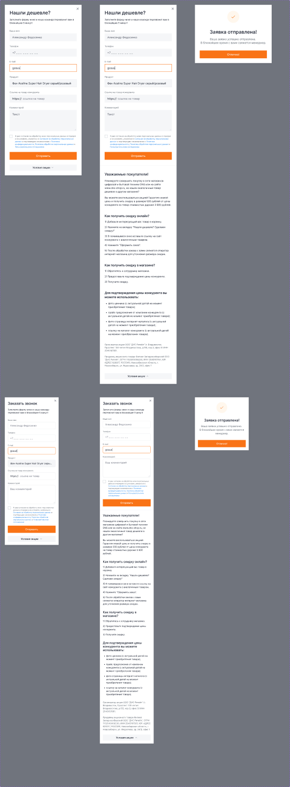

Поля «Нашли дешевле»: Ваше имя, Телефон, E-mail, Продукт, Ссылка на товар конкурента, Комментарий, чекбокс согласия, кнопка «Отправить», ниже сворачиваемый блок «Условия акции» с длинным юридическим текстом.

Финальное состояние — «Заявка отправлена! Ваша заявка успешно отправлена. В ближайшее время с вами свяжется менеджер» + кнопка «Отлично!».

---

## Cookies — `22924:23641`, 2 варианта

Плашка 773×106 на десктопе, 359×144 на мобайле, позиционируется внизу экрана. Иконка cookie слева, текст «Мы используем данные cookie, чтобы улучшить работу сайта, в соответствии с политикой использования cookie» (ссылка — синяя, а не брендовая оранжевая — уточнить у дизайнера), справа кнопки «Согласен» (оранжевая) и «Не согласен» (серая). На мобильном кнопки уходят под текст.

## Вход и регистрация (8 сентября 2026)

**Отклонение от макета по требованию заказчика:**

1. В модалке входа убран переключатель «Телефон / E-mail» — авторизация только по почте.
   Разметка `.modal__tabs` и её стили из `modals.css` удалены.
2. Кнопка «Войти» в форме входа и «Зарегистрироваться» в форме регистрации ведут
   в личный кабинет: формам добавлены `data-form data-form-redirect="account.html"`,
   переход выполняет общий обработчик форм в `js/main.js`.

Проверено на 1440 и 375: в модалке входа два поля (E-mail, Пароль), табов нет, обе кнопки
переводят на `account.html`, ошибок консоли нет.

---

## Добавлено 10 сентября

**Уведомить о поступлении** — `data-modal="notify"`. Макета нет, форма собрана на общих
полях: e-mail (обязательный), телефон и согласие, ниже экран успеха. В подзаголовок
подставляется товар с выбранным объёмом. Открывается с плитки закончившегося товара
и из карточки товара, см. [22-stock-states.md](22-stock-states.md).
