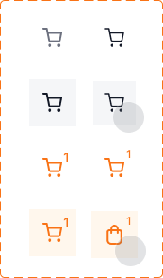
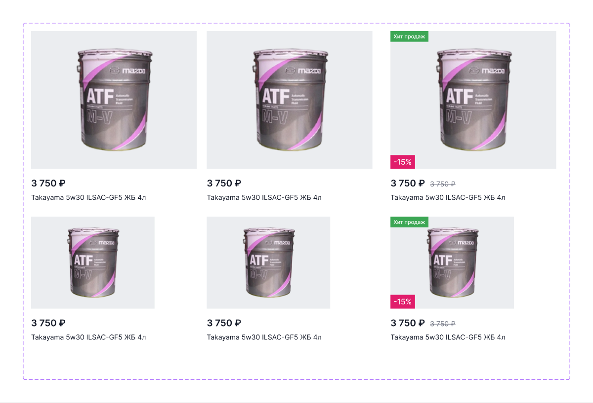
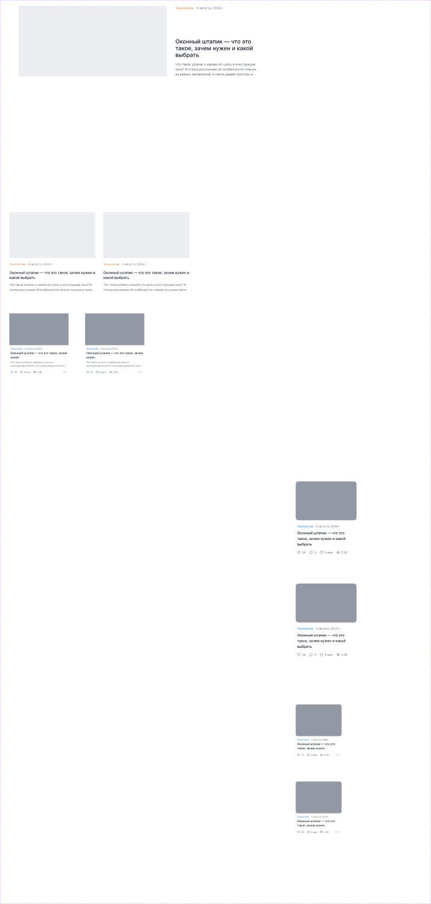
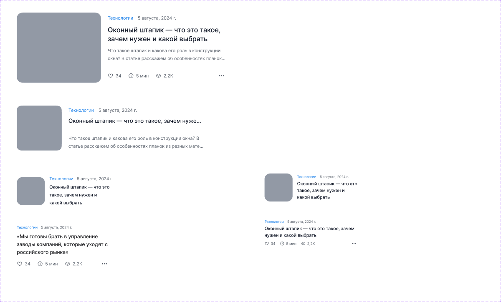
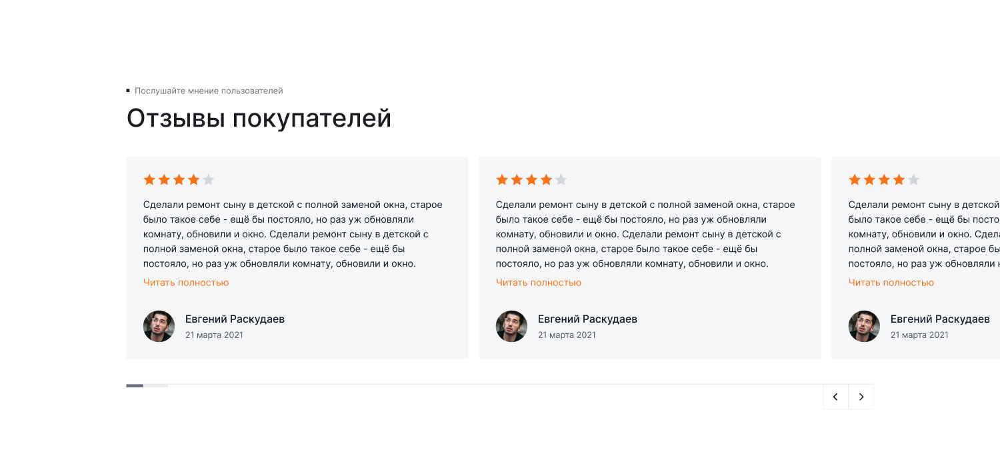
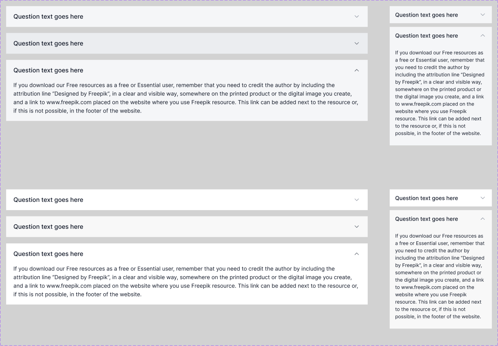
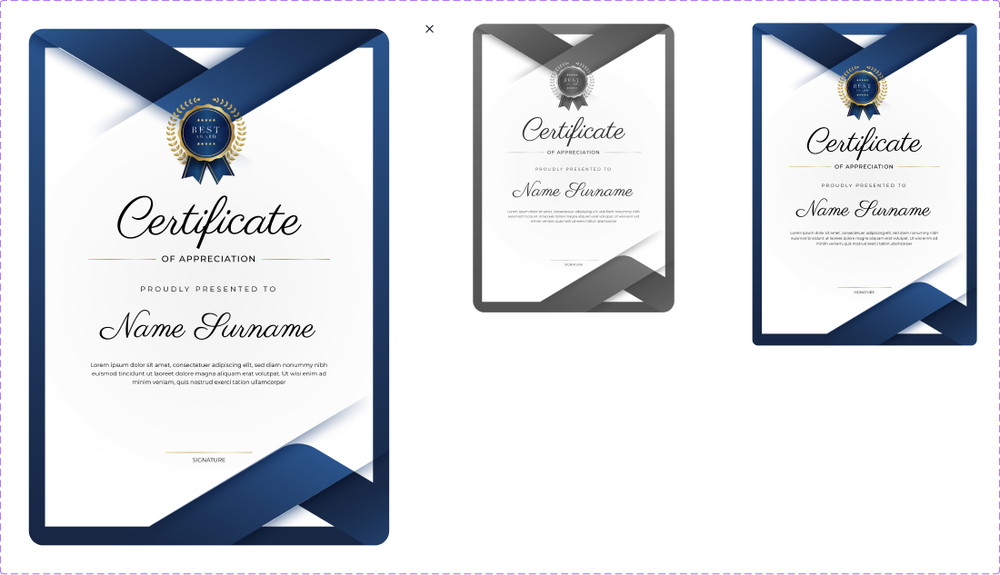
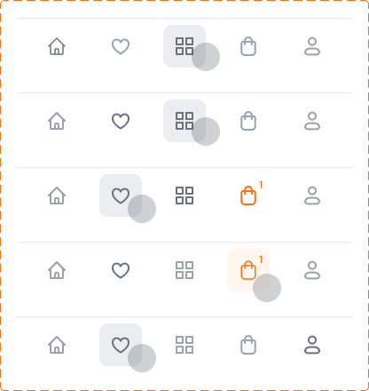
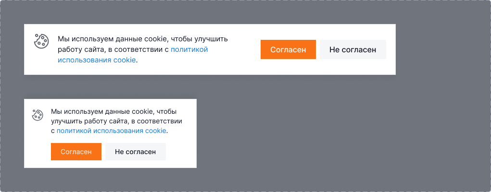

[← Оглавление](README.md)

# 04. Компоненты

Всё, что переиспользуется на нескольких страницах. Токены и базовые классы — в [01-tokens.md](01-tokens.md) и [tokens.css](tokens.css).

---

## Кнопки

| Тип | Фон | Текст | Паддинг | Радиус |
|---|---|---|---|---|
| Первичная | `--ko-btn-brand` `#f97316` | белый | 14 / 24 | 0 |
| Вторичная | `--ko-btn-grey` `#f5f6f8` | `--ko-text-1` | 14 / 24 | 0 |
| Белая (на тёмном) | `#ffffff` | `--ko-text-1` | 14 / 24 | 0 |
| Текстовая (`Text btn`) | нет | `--ko-text-1`, в hover — `--ko-text-accent` | — | — |

Высота кнопки в шапке и в карточке товара — **52 px**. В футере соцсети — квадраты 52×52 с шагом 60.

Иконочная кнопка `Header btn` (`2099:58391`) — 8 вариантов: `Hover` × `Add` (бейдж-счётчик) × `Mobile`. 52×52 десктоп, 48×48 мобайл.



---

## Поля ввода

```html
<label class="ko-field">
  <span class="ko-field__label">E-mail</span>
  <input class="ko-input" type="email" placeholder="mail@example.com">
  <span class="ko-input-error-text">Введите корректный e-mail</span>
</label>
```

Состояния: обычное (фон `--ko-bg-1`, рамка `--ko-border-1`) → фокус (рамка оранжевая, фон белый) → заполненное → ошибка (фон `#fdecec`, рамка `#ee443f`, подпись красным).

Спецполя: пароль с иконкой «глаз», дата с иконкой календаря и маской `__ / __ / __`, телефон с маской `+7 ___ ___ __ __`, код подтверждения — 4 отдельные ячейки, активная с оранжевой рамкой.

Тумблер (switch) — используется в регистрации («Аккаунт для компании»), в активном состоянии оранжевый.

---

## Теги, чипы, табы

| Элемент | Размер | Где |
|---|---|---|
| Тег характеристики (`Tag`) | высота 36, паддинг 10 по горизонтали | карточка товара: «Синтетическое», «5W-30», «4 Л», «A3/B4» |
| Чип фильтра | высота ~32, с крестиком справа | каталог: активные фильтры |
| Чип бренда | высота ~36 | каталог: популярные бренды |
| Таб выбора (`Tabs border`) | высота 40 | выбор объёма в карточке товара, активный — оранжевая рамка |
| Таб «Телефон / E-mail» | паддинг 6 | модалка авторизации |

## Бейджи

| Бейдж | Фон | Текст | Позиция |
|---|---|---|---|
| «Хит продаж» | `--ko-other-1` `#3da755` | белый, `Caption` 14/20 | левый верхний угол изображения |
| «−15 %» / «−17 %» | `--ko-other-2` `#e11d6b` | белый | левый нижний угол изображения (в карточке товара — рядом с ценой) |

---

## Карточка товара (тайл)



Размер в каталоге — **460×450**, в сетке 3 колонки, гэп 20 / 48.

Состав сверху вниз: изображение на фоне `--ko-bg-2` (квадрат по ширине карточки) → цена `Large xl s` 24/34 **600** → зачёркнутая старая цена `--ko-text-3` (если есть скидка) → название `Small r` 16/24.

Бейджи накладываются на изображение. Есть компактный вариант карточки (используется в блоке «Хиты продаж» на главной во втором ряду).

---

## Карточки статей



Набор `Standard article` (`22997:102409`, 9 вариантов) и `Standard article - overlay` (`22997:102710`, 20 вариантов: Small 1/2, Normal 1/2, Large 1/2 × desktop/mobile × 2 состояния).

Состав: изображение → рубрика (оранжевая, `Caption`) + дата (`--ko-text-3`) → заголовок → лид в 2–3 строки с многоточием. У части вариантов добавляется строка метрик: лайки, комментарии, время чтения, просмотры.

Горизонтальные карточки — `Horizon article` (`22997:103259`, 6 вариантов) и `Horizon article - overlay` (`22997:103311`, 6):



Размеры: Large 774×256, Normal 680×160, Small 335×110, Text 332×160 (без картинки).

---

## Отзывы



Карусель. Карточка на фоне `--ko-bg-1`: 4–5 звёзд (оранжевые), текст отзыва до 6 строк, ссылка «Читать полностью» (оранжевая), внизу аватар (круглый), имя `Base m`, дата `--ko-text-3`.

Под каруселью — полоса-скроллбар слева и стрелки «‹ ›» справа.

Отдельный фрейм `Review / 1` (`22924:24281`) в файле есть, но через MCP он не отдаётся (скрытый слой). Верстаем по секции отзывов со страниц.

---

## FAQ (аккордеон)



Компонент `FAQ / 1` (`22924:17200`). Строка: фон `--ko-bg-1`, заголовок вопроса `Base m` 18/24, шеврон справа. Состояния: обычное, hover (фон темнее — `--ko-bg-2`), раскрытое (фон белый, под заголовком текст ответа `Small r`).

Ширина на десктопе — правая колонка ~1020 px (левая занята заголовком секции). Есть узкий вариант ~250 px для мобильного.

⚠️ В макете тексты-рыба на английском (Freepik). Реальные вопросы нужно взять у заказчика.

---

## Сертификаты



- `Certificates` (`22924:17265`) — миниатюра 184×310, состояния Static / Hover / Mobile (162×269)
- `Certificates view` (`22924:17255`) — просмотр в лайтбоксе: крупное изображение 539×756 с крестиком закрытия, рядом соседние сертификаты меньшего размера

На главной идут каруселью из 6 штук с подписями брендов (Shell, Mobil, Castrol, Liqui Moly, Lukoil).

---

## Пагинация

Кнопки-квадраты: активная — оранжевый фон, белый текст; остальные — белый фон с рамкой `--ko-border-1`. Многоточие между диапазонами, последняя страница, ссылка «Дальше →» справа.

---

## Таббар (мобильный)



376×64, 5 иконок: главная, избранное, каталог, корзина, профиль. Активная подсвечена подложкой `--ko-bg-1`, у корзины бейдж-счётчик. Фиксируется внизу экрана.

---

## Cookies



773×106 (десктоп) / 359×144 (мобайл). Иконка + текст + кнопки «Согласен» / «Не согласен».

---

## Плейсхолдеры изображений

Везде, где фото ещё нет, в макете стоит прямоугольник `--ko-bg-2` `#ebedf0` (карта на контактах, картинка в SEO-блоке, изображения статей). В вёрстке это должны быть обычные `` с реальными пропорциями, а серый фон — только фолбэк при загрузке.
