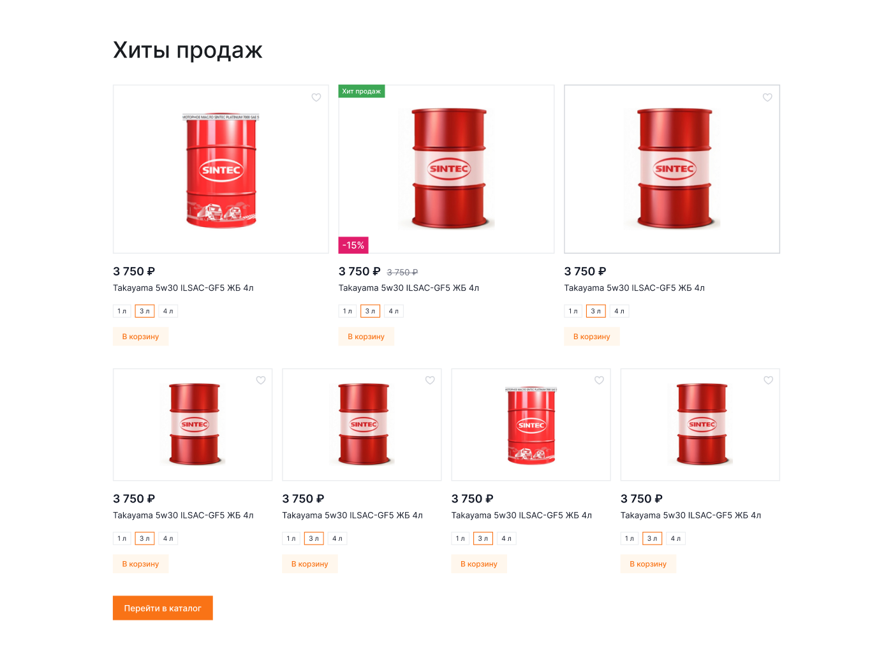
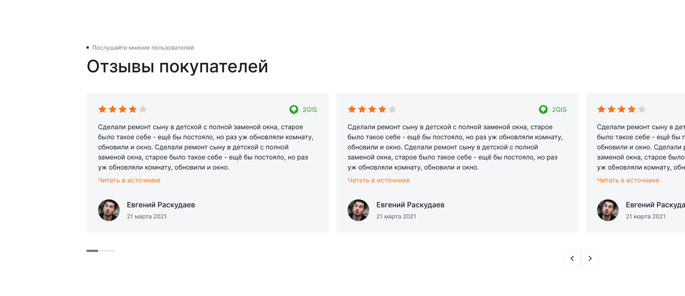

[← Оглавление](README.md)

# 04. Компоненты

Всё, что переиспользуется на нескольких страницах. Токены и базовые классы — в [01-tokens.md](01-tokens.md) и [tokens.css](tokens.css).

---

## Кнопки

| Тип | Фон | Текст | Паддинг | Радиус |
|---|---|---|---|---|
| Первичная | `--ko-btn-brand` `#f97316` | белый | 14 / 24 | 0 |
| Вторичная | `--ko-btn-grey` `#f5f6f8` | `--ko-text-1` | 14 / 24 | 0 |
| Белая (на тёмном) | `#ffffff` | `--ko-text-1` | 14 / 24 | 0 |
| Текстовая (`Text btn`) | нет | `--ko-text-1`, в hover — `--ko-text-accent` | — | — |

Высота кнопки в шапке и в карточке товара — **52 px**. В футере соцсети — квадраты 52×52 с шагом 60.

Иконочная кнопка `Header btn` (`2099:58391`) — 8 вариантов: `Hover` × `Add` (бейдж-счётчик) × `Mobile`. 52×52 десктоп, 48×48 мобайл.


---

## Поля ввода

```html
<label class="ko-field">
  <span class="ko-field__label">E-mail</span>
  <input class="ko-input" type="email" placeholder="mail@example.com">
  <span class="ko-input-error-text">Введите корректный e-mail</span>
</label>
```

Состояния: обычное (фон `--ko-bg-1`, рамка `--ko-border-1` **2 px**) → фокус (рамка оранжевая) →
заполненное → ошибка (фон `#fdecec`, рамка `#ee443f`, подпись красным).

Высота контрола ровно **52** = 2 рамки + 12 + строка 24 + 12 + 2.

⚠️ **Поле на залитой подложке** (подбор по авто в каталоге, уточнение способа получения в
оформлении, форма «Остались вопросы?») — белое и **без рамки**: так собран `Base input`
в макете (`26756:610`). Рамка нужна только когда контрол стоит на белом фоне
(`Base selection` `26757:610`). В вёрстке это модификаторы `.input--white` и `.select--white`.

### Выпадающий список

Системный `<select>` не используем: его список рисует ОС, к макету не привести. Свой
компонент: кнопка повторяет `Base selection`, панель — как у сортировки в каталоге.

```html
<div class="select" data-select>
  <button class="select__btn" type="button" data-select-btn aria-expanded="false">
    <span class="select__value">Частное лицо</span><svg><use href="#i-chevron"></use></svg>
  </button>
  <div class="select__panel" hidden data-select-panel>
    <button class="select__option is-active" type="button">Частное лицо</button>
  </div>
</div>
```

Атрибут `data-select-multi` включает мультивыбор: пункты становятся чекбоксами, в подписи
кнопки перечисляется выбранное. Так собраны фильтры каталога.

### Радиокнопка

Кольцо 20 с обводкой 2 `--ko-border-4`, наведение — обводка темнеет до `--ko-icon-3`,
выбранная — брендовая обводка и точка 10 внутри. Системную (`accent-color`) не используем.

Спецполя: пароль с иконкой «глаз», дата с иконкой календаря и маской `__ / __ / __`, телефон с маской `+7 ___ ___ __ __`, код подтверждения — 4 отдельные ячейки, активная с оранжевой рамкой.

Тумблер (switch) — используется в регистрации («Аккаунт для компании»), в активном состоянии оранжевый.

---

## Теги, чипы, табы

| Элемент | Размер | Где |
|---|---|---|
| Тег характеристики (`Tag`) | высота 36, паддинг 10 по горизонтали | карточка товара: «Синтетическое», «5W-30», «4 Л», «A3/B4» |
| Чип фильтра | высота ~32, с крестиком справа | каталог: активные фильтры |
| Чип бренда | высота 52, паддинг 24 по горизонтали | каталог: популярные бренды |
| Таб выбора (`Tabs border`) | высота 40, обводка **2** | выбор объёма в карточке товара, активный — оранжевая рамка |
| Таб «Телефон / E-mail» | паддинг 6 | модалка авторизации |

## Бейджи

| Бейдж | Фон | Текст | Позиция |
|---|---|---|---|
| «Хит продаж» | `--ko-other-1` `#3da755` | белый, `Caption` 14/20 | левый верхний угол изображения |
| «−15 %» / «−17 %» | `--ko-other-2` `#e11d6b` | белый | левый нижний угол изображения (в карточке товара — рядом с ценой) |

---

## Карточка товара (тайл)



> Переработана 4 сентября 2026. Набор вариантов — фрейм `spec tile` (`26702:35538`),
> оси: `Size` (Large / Mini) × `Status` (Static / Hover / Added to favorites) ×
> `Sale` (Yes / No) × `Хит продаж` (Yes / No) × `Mobile` (Yes / No).

| Вариант | Размер |
|---|---|
| Large | 432×556 |
| Mini | 322×436 |
| Mini, Mobile | 166×322 |

Состав сверху вниз:

1. **Изображение** на белой подложке с рамкой `--ko-border-1`, квадрат по ширине карточки.
   В правом верхнем углу — иконка-сердце 24×24 (`--ko-icon-2`; в состоянии
   `Added to favorites` заливается оранжевым). Бейджи накладываются на изображение:
   «Хит продаж» — левый верхний угол, «−15 %» — левый нижний.
2. **Цена** `Large xl s` 24/34 600, рядом зачёркнутая старая цена `--ko-text-3`
3. **Название** `Small r` 16/24, на мини-карточке обрезается многоточием в одну строку
4. **Ряд чипсов объёма** — «1 л / 3 л / 4 л», высота 28, рамка `--ko-border-1`,
   выбранный чипс — рамка `--ko-border-brand` и текст `--ko-text-accent`
5. **Кнопка «В корзину»** — подложка бледно-оранжевая (`--ko-bg-brand` с прозрачностью ~12 %),
   текст `--ko-text-accent`, высота 40, ширина по содержимому

Чипсы объёма — **варианты одного товара**: клик меняет цену, артикул и наличие прямо в
карточке, отдельной страницы у объёма нет, в корзину уходит выбранный (решение от 4 сентября).

Hover: рамка карточки темнеет, кнопка «В корзину» становится сплошной оранжевой.

---

## Карточки статей


Набор `Standard article` (`22997:102409`, 9 вариантов) и `Standard article - overlay` (`22997:102710`, 20 вариантов: Small 1/2, Normal 1/2, Large 1/2 × desktop/mobile × 2 состояния).

Состав: изображение → рубрика (оранжевая, `Caption`) + дата (`--ko-text-3`) → заголовок → лид в 2–3 строки с многоточием. У части вариантов добавляется строка метрик: лайки, комментарии, время чтения, просмотры.

Горизонтальные карточки — `Horizon article` (`22997:103259`, 6 вариантов) и `Horizon article - overlay` (`22997:103311`, 6):


Размеры: Large 774×256, Normal 680×160, Small 335×110, Text 332×160 (без картинки).

---

## Отзывы



> Переработана 4 сентября 2026: добавлен логотип 2GIS, ссылка стала «Читать в источнике».

Карточка на фоне `--ko-bg-1` без рамки, паддинг 24, ширина в карусели ~496, на странице
[отзывов](17-page-reviews.md) — 700.

Сверху ряд: слева **5 звёзд** 20×20 (закрашенные `--ko-bg-brand`, незакрашенные `--ko-bg-3`),
справа **логотип 2GIS** — зелёная капля + подпись «2GIS».
Ниже текст отзыва `Small r ⭥` 16/28 (в карусели обрезается, на странице — целиком),
оранжевая ссылка **«Читать в источнике»**, внизу круглый аватар 40×40, имя `Base m`,
под ним дата `Caption`, `--ko-text-3`.

Под каруселью — индикатор прокрутки слева и стрелки справа.

**Индикатор** (`Progressbar`, 79×6): трек шириной 79 на фоне `--ko-bg-2` `#ebedf0` и заливка поверх него цветом `--ko-icon-2` `#6d717f`. Полоса **не двигается** — растёт заливка по мере прокрутки ленты. В макете зафиксировано состояние 32 из 79.

**Стрелки** — 48×48, вплотную друг к другу, общая ширина 96, прижаты к правому краю контейнера.

Отдельный фрейм `Review / 1` (`22924:24281`) в файле есть, но через MCP он не отдаётся (скрытый слой). Верстаем по секции отзывов со страниц.

---

## FAQ (аккордеон)


Компонент `FAQ / 1` (`22924:17200`). Строка: фон `--ko-bg-1`, заголовок вопроса `Base m` 18/24, шеврон справа. Состояния: обычное, hover (фон темнее — `--ko-bg-2`), раскрытое (фон белый, под заголовком текст ответа `Small r`).

Ширина на десктопе — правая колонка ~1020 px (левая занята заголовком секции). Есть узкий вариант ~250 px для мобильного.

⚠️ В макете тексты-рыба на английском (Freepik). Реальные вопросы нужно взять у заказчика.

---

## Сертификаты


- `Certificates` (`22924:17265`) — миниатюра 184×310, состояния Static / Hover / Mobile (162×269)
- `Certificates view` (`22924:17255`) — просмотр в лайтбоксе: крупное изображение 539×756 с крестиком закрытия, рядом соседние сертификаты меньшего размера

На главной идут каруселью из 6 штук с подписями брендов (Shell, Mobil, Castrol, Liqui Moly, Lukoil).

---

## Пагинация

Кнопки-квадраты: активная — оранжевый фон, белый текст; остальные — белый фон с рамкой `--ko-border-1`. Многоточие между диапазонами, последняя страница, ссылка «Дальше →» справа.

---

## Таббар (мобильный)


376×64, 5 иконок: главная, избранное, каталог, корзина, профиль. Активная подсвечена подложкой `--ko-bg-1`, у корзины бейдж-счётчик. Фиксируется внизу экрана.

---

## Cookies


773×106 (десктоп) / 359×144 (мобайл). Иконка + текст + кнопки «Согласен» / «Не согласен».

---

## Фото товаров

В `src/img/products/` лежат 112 фото, выгруженных 7 сентября 2026 из каталога боевого сайта
`kingoil.itb-dev.ru` (разделы моторных масел по брендам, антифризы, лампы, аккумуляторы,
трансмиссионные). Оригиналы CS-Cart из `/images/detailed/` уменьшены до 560 и пережаты в JPEG
(28 МБ → 3 МБ). Названия карточек на страницах взяты оттуда же, чтобы подпись совпадала с фото.

Фото стоят в сетках главной, каталога, похожих товаров, избранного, в галерее карточки
товара и в строках корзины и заказа. Кадр изображения — белый с рамкой `--ko-border-1` 2 px,
`object-fit: contain`.

## Плейсхолдеры изображений

Там, где фото ещё нет (карта на контактах, картинка в SEO-блоке, изображения статей),
в макете стоит прямоугольник `--ko-bg-2` `#ebedf0`. В вёрстке это должны быть обычные ``
с реальными пропорциями, а серый фон — только фолбэк при загрузке.

## Правки состояний (7 сентября 2026)

- **Белая кнопка** (`.btn--white`) на наведении не сереет: она стоит на серых подложках и
  сливалась с фоном. Остаётся белой и берёт фирменную обводку.
- **Белые поля и селекты** (`--white`) на наведении не показывают обводку — рамка только
  на фокусе.
- **Сердце «в избранное»** заливается в выбранном состоянии: символ `i-heart` в спрайте
  собирается с `fill="var(--i-fill, none)"`, заливку включает `.product-card__fav.is-active`.
  Список таких символов — `FILLABLE` в `build-sprite.py`.
- **Фото товара** в корзине и в составе заказа — белая плитка с обводкой вместо серой заливки.
- **Ссылки разделов в подвале** — чёрные (`--ko-text-1`), оранжевые на наведении.
- **Кнопка «Удалить аккаунт»** — новый вариант `.btn--danger` (подложка `--ko-bg-error`).

## Карточка-фича (обновление макета 7 сентября 2026)

Дизайнер переделал карточки преимуществ на странице «Как купить» (`26847:25852`):
белого квадрата 64×64 под иконкой больше нет — иконка 32 лежит прямо на подложке
карточки, от неё до заголовка 64.

| Параметр | Значение |
|---|---|
| Карточка | подложка `--ko-bg-1`, паддинг 24, высота 284 (4 в ряд) / 236 (3 в ряд) |
| Иконка | 32×32, цвет `--ko-icon-3` |
| Отступ иконка → заголовок | 64 |
| Заголовок | `Heading 6` 24/32 |
| Описание | `Caption xl`, `--ko-text-2` |
| Шаги (`Services / 3 /`) | вместо иконки номер 01–04, `Large xl`, акцентный цвет |

Тот же компонент используем на всех информационных разделах: «Как купить», «Доставка»,
«Оплата», «Возврат и обмен».

## Ещё правки состояний (7 сентября 2026)

- Кнопка «В корзину» на наведении берёт `Secondary buttons/brand-hover` `#ffedd5`
  (токен `--ko-btn-brand-soft-hover`), текст остаётся оранжевым. Срабатывает **только на
  самой кнопке** — наведение на карточку её не трогает.
- Теги выбранных фильтров в каталоге не сжимаются: ряд переносится на вторую строку,
  «Сбросить» остаётся прижатым вправо.
- Отступ от хлебных крошек до H1 увеличен до 40 (было 24) на всех страницах.

## Правки 7 сентября 2026 (вторая волна)

- **Счётчик количества** собран по макету `26766:1395`: три отдельные ячейки с зазором 4 —
  «минус» на `--ko-bg-1`, поле белое с рамкой `--ko-border-1`, «плюс» на
  `--ko-btn-brand-soft`. Общая ширина 216, высота 52. Стартовое значение — 1.
- **Белая кнопка** (`.btn--white`): по атомам на наведении меняется только прозрачность
  (`opacity: .8`), обводка и цвет текста прежние.
- **Стрелки каруселей** стоят вплотную через `margin-left: -1px` вместо `border-left: 0` —
  раньше у второй кнопки не было левой грани и она «пропадала» на наведении.
- **Карточка-фича, вариант адреса** (`.feature--address`): без иконки, заголовок `Large`
  20/28, описание `Caption` 14/20.
- **Иконка `i-percent`** перерисована вручную: выгруженный из Figma контур занимал 14.8 из
  24 и рядом с остальными иконками смотрелся мелким.
- **Карточка товара**: рейтинг и «124 отзыва» убраны — собственных отзывов о товаре нет.

## Хлебные крошки: выравнивание отступов (7 сентября 2026)

По макету блок `Sec / Breadcrumbs` — 1900×72: текст на `y=24`, то есть **24 сверху**,
строка 24 и 24 снизу (сверено по узлам `26899:22688` «О компании» и `26785:1937`
«Контакты» — оба идентичны). Снизу у нас осознанные **40** вместо 24, см. запись выше.

На «О компании» крошки были обёрнуты в лишнюю `<section class="section section--pt-24">`,
и её паддинг складывался с `padding-top: 24` самих крошек — получалось 48 сверху вместо 24,
а до H1 — 80 вместо 40 (ещё и `section--pt-40` у героя). Страница выбивалась из общего
ритма: крошки стояли на 24 px ниже, чем на всех остальных.

Приведено к единому паттерну — крошки лежат прямо в `<div class="container">`, у героя
`section--pt-0`. Замер в браузере на 1900: шапка 160, текст крошек ниже неё на 24 —
одинаково на всех 18 страницах с крошками, расхождение с макетом 0 px.

Исключение: `promo-detail` — там `.promo-detail__crumbs` добавляет 10 снизу, потому что
дальше идёт не H1, а секция `Featured` со своим `section--pt-40`.
