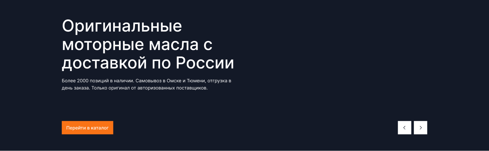
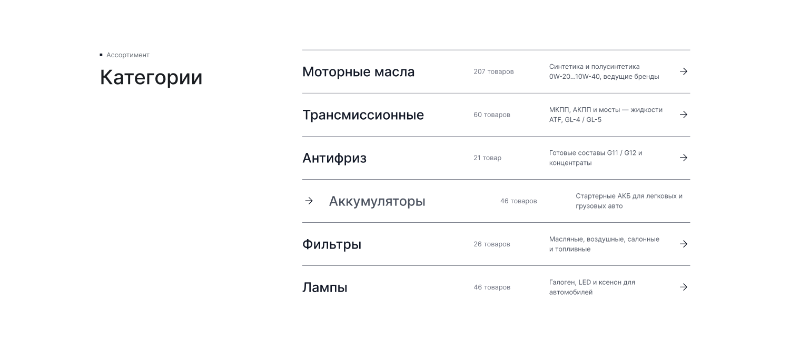
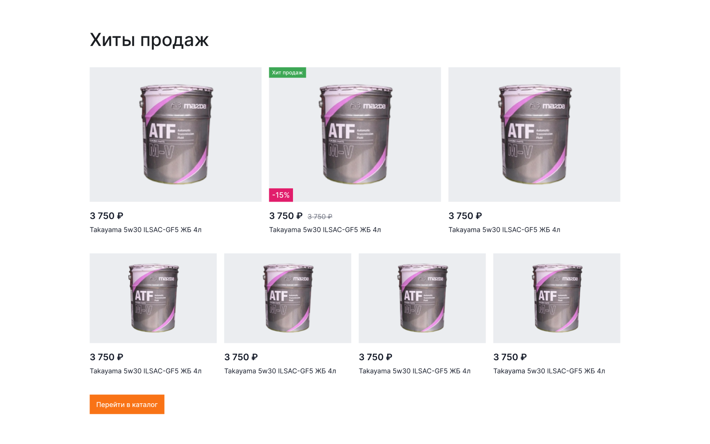
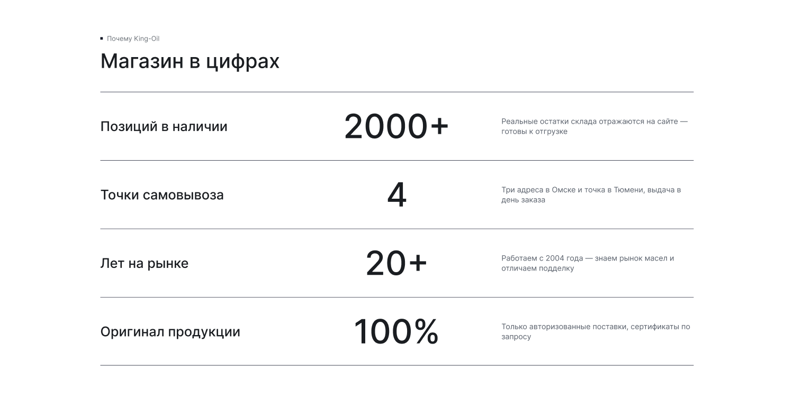
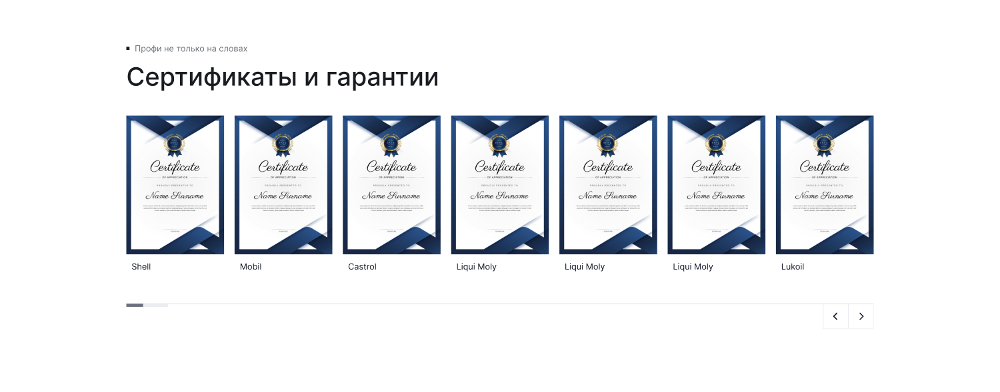
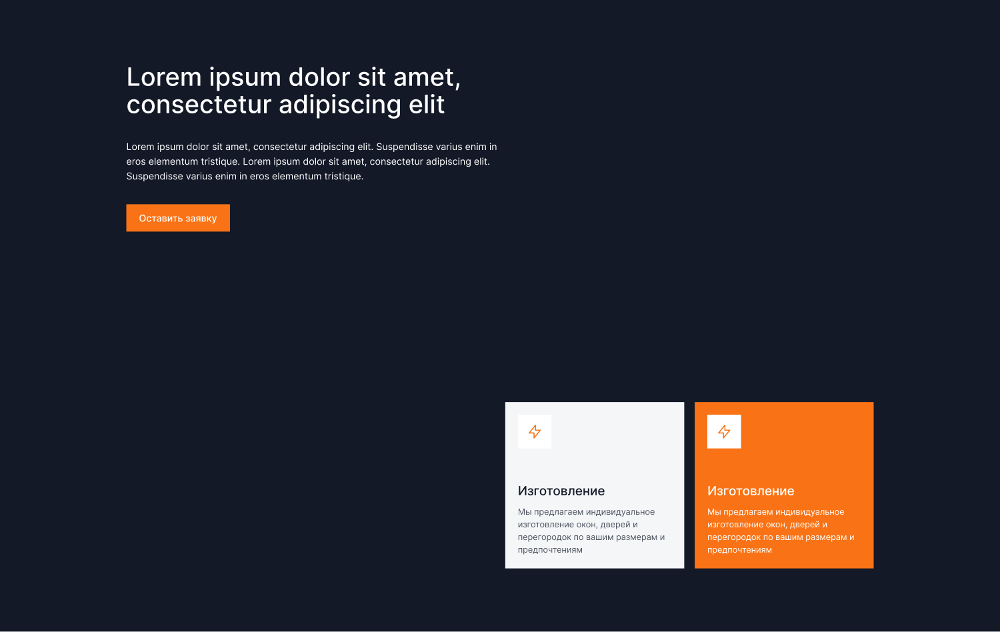
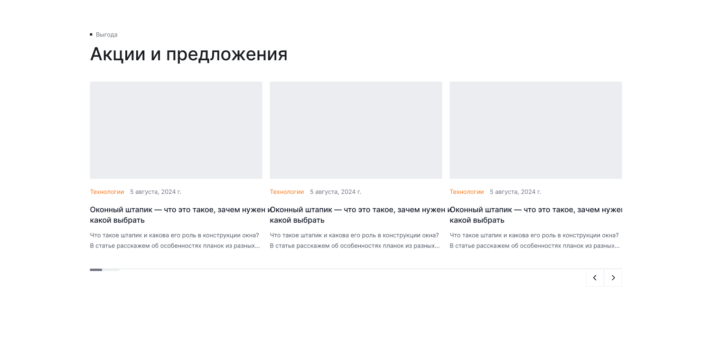

[← Оглавление](README.md)

# 05. Главная

`26701:7944` — 1900×9032. Полный вид: [00-full.png](img/pages/main/00-full.png)
Мобильная версия — `26886:5536`, 375×8986, см. [18-mobile.md](18-mobile.md).

> Обновлено 4 сентября 2026 по новой версии макета. Было 8033, стало 9032: переделаны
> слайдер, хиты, цифры и тёмная секция, добавлена CTA-форма, вырос футер.

Порядок секций и их высоты:

| # | Секция | Node | Высота | Что изменилось |
|---|---|---|---|---|
| — | Шапка | `26701:7945` | 160 | без изменений |
| 1 | Главный слайдер | `26899:12612` | 600 | новое фото и текст, было 588 |
| 2 | Категории | `26701:7951` | 824 | без изменений |
| 3 | Хиты продаж | `26701:7990` | 1400 | карточки с выбором объёма, было 1188 |
| 4 | Магазин в цифрах | `26701:8135` | 1040 | бенто-сетка вместо строк, было 956 |
| 5 | Сертификаты и гарантии | `26701:8162` | 746 | новый надзаголовок, 7 карточек |
| 6 | Подбор масла (тёмная секция) | `26702:36242` | 1200 | переделана целиком |
| 7 | Отзывы покупателей | `26702:38553` | 822 | новая карточка отзыва с 2ГИС |
| 8 | Акции и предложения | `26701:8221` | 846 | без изменений |
| 9 | «Остались вопросы?» — форма | `26899:11679` | 468 | **новая секция** |
| 10 | Футер | `26899:23133` | 926 | переделан, было 587 |

---

## 1. Главный слайдер — 1900×600

Фон на всю ширину — тёмное фото: чёрный автомобиль, на нём две канистры ЛУКОЙЛ Genesis
Armortech 0W-20. Кадр тёмный сам по себе, затемняющая подложка не нужна.

Слева внутри контейнера:
- H2 в три строки, белый: **«Оригинальные моторные масла с доставкой по России»**
- лид `Base r ⭥` 18/28 в две строки: «Более 2000 позиций в наличии. Самовывоз в Омске и Тюмени, отгрузка в день заказа. Только оригинал от авторизованных поставщиков.»
- оранжевая кнопка **«Перейти в каталог»** 200×52

Справа внизу — две стрелки: белые квадраты 52×52 с гэпом 10, шеврон `--ko-text-1`.
Правый край стрелок — 1660.

## 2. Категории — 1900×824

Без изменений. Слева надзаголовок «▪ Ассортимент» и H2 «Категории», справа список из 6 строк.
Строка: название (`Heading 6`) — количество товаров — описание в две строки — стрелка «→».
Hover (показан на «Аккумуляторы»): стрелка переезжает влево перед названием, текст сереет.

| Категория | Товаров | Описание |
|---|---|---|
| Моторные масла | 207 | Синтетика и полусинтетика 0W-20…10W-40, ведущие бренды |
| Трансмиссионные | 60 | МКПП, АКПП и мосты — жидкости ATF, GL-4 / GL-5 |
| Антифриз | 21 | Готовые составы G11 / G12 и концентраты |
| Аккумуляторы | 46 | Стартерные АКБ для легковых и грузовых авто |
| Фильтры | 26 | Масляные, воздушные, салонные и топливные |
| Лампы | 46 | Галоген, LED и ксенон для автомобилей |

## 3. Хиты продаж — 1900×1400

H3 «Хиты продаж», два ряда карточек, снизу слева оранжевая кнопка «Перейти в каталог».
- ряд 1 — 3 крупные карточки (`Size=Large`, 460×556)
- ряд 2 — 4 карточки поменьше (`Size=Mini`, 340×436)

**Карточка товара переделана** — подробно в [04-components.md](04-components.md#карточка-товара).
Коротко, сверху вниз: картинка на подложке с рамкой и сердцем в правом верхнем углу,
бейджи «Хит продаж» (зелёный, слева сверху) и «−15 %» (розовый, слева снизу), цена
(`Heading 6`) и рядом зачёркнутая старая, название в одну-две строки, **ряд чипсов объёма
«1 л / 3 л / 4 л»** (выбранный — оранжевая рамка), кнопка «В корзину» на бледно-оранжевой
подложке.

~~Объём — вариант одного товара: клик по чипсу меняет цену, артикул и наличие прямо в~~
(с 11 сентября 2026 чипс — ссылка на соседний товар CS-Cart, см. [29-cscart-data-pass.md](29-cscart-data-pass.md))
карточке, в корзину уходит выбранный объём.

## 4. Магазин в цифрах — 1900×1040

Надзаголовок «▪ Почему King-Oil», H2 «Магазин в цифрах». Вместо прежних строк с
разделителями — **бенто-сетка карточек на подложке `--ko-bg-1`**:

- ряд 1: карточка «Позиций в наличии» (460 ширина) + широкое фото склада с погрузчиком и бочками SINTEC
- ряд 2: три карточки равной ширины

Карточка: подпись сверху (`Base m`), крупное число внизу (`Heading 2` 64/72), под ним
пояснение (`Caption`, `--ko-text-3`). Числа прижаты к низу карточки.

| Число | Подпись | Пояснение |
|---|---|---|
| 2000+ | Позиций в наличии | Реальные остатки склада отражаются на сайте |
| 4 | Точки самовывоза | Три адреса в Омске и точка в Тюмени, выдача в день заказа |
| 100 % | Оригинал продукции | Авторизованные поставки, сертификаты по запросу |
| 20+ | Лет на рынке | Работаем с 2004 года — знаем рынок масел и отличаем подделку |

## 5. Сертификаты и гарантии — 1900×746

Надзаголовок сменился: было «▪ Продаём только оригинал», стало **«▪ Профи не только на словах»**.
H3 «Сертификаты и гарантии», карусель из 7 карточек с подписями брендов: Shell, Mobil,
Castrol, Liqui Moly ×3, Lukoil. Снизу слева полоса прогресса, справа стрелки.

⚠️ Сами изображения — заглушки «Certificate of appreciation / Name Surname». Настоящие
сертификаты заказчик обещал позже; подписи брендов оставляем как в макете.

## 6. Подбор масла — 1900×1200

**Секция переделана целиком** — прежних Lorem ipsum и карточек из проекта про окна больше нет.

Фон на всю ширину — фото: мастер в чёрных перчатках заливает ЛУКОЙЛ Genesis через воронку,
на крыле машины стоит вторая канистра, на рукаве — логотип King-Oil.

Слева сверху внутри контейнера:
- H3 в две строки, белый: **«Подберём масло под ваш двигатель и допуски»**
- абзац в три строки: «Оставьте заявку — перезвоним, уточним марку, модель и год выпуска, проверим допуски производителя и предложим оригинал из наличия. Рассчитаем доставку в ваш регион.»
- оранжевая кнопка **«Оставить заявку»**

## 7. Отзывы покупателей — 1900×822

Надзаголовок «▪ Послушайте мнение пользователей», H2 «Отзывы покупателей», карусель,
снизу полоса прогресса и стрелки.

**Карточка отзыва переделана:** подложка `--ko-bg-1` без рамки, ширина ~496, внутри
сверху ряд — 5 звёзд (закрашенные оранжевые, незакрашенные серые) и справа **логотип 2GIS**;
затем текст отзыва (обрезка по высоте), оранжевая ссылка **«Читать в источнике»**, внизу
круглый аватар 40×40, имя (`Base m`) и дата (`Caption`, `--ko-text-3`).

Источник данных — карточка компании в 2ГИС, см. [17-page-reviews.md](17-page-reviews.md).

## 8. Акции и предложения — 1900×846

Надзаголовок «▪ Выгодно», H2 «Акции и предложения», 3 карточки статей в ряд, снизу полоса
прогресса и стрелки. Карточка: изображение 16:9, ряд «рубрика (оранжевая) + дата», заголовок
в две строки, лид в две строки с многоточием.

⚠️ Контент в макете — по-прежнему рыба про оконный штапик. Заполняем сами по боевому сайту.

## 9. «Остались вопросы?» — 1900×468

Новая общая секция `CTA / 14 /` — тот же компонент, что на «Контактах», «Доставке»,
«Странице акции», «Отзывах» и «О компании». Подложка `--ko-bg-1`.

Слева: надзаголовок «▪ Обратная связь», H2 «Остались вопросы?», абзац «Оставьте заявку —
перезвоним, поможем подобрать масло и рассчитаем стоимость доставки в ваш регион.»
Справа: поля «Ваше имя» и «+7» в ряд, «Опишите вопрос» на всю ширину, чекбокс согласия
с оранжевыми ссылками, оранжевая кнопка «Отправить заявку».

## 10. Футер

См. [12-footer.md](12-footer.md) — переделан.

## Слайдер и категории (7 сентября 2026)

**Главный слайдер.** В вёрстке три слайда (`[data-hero-slide]`), они лежат стопкой в одной
ячейке грида и переключаются стрелками или сами раз в 10 секунд (`js/main.js`). Уходящий
слайд скрывается сразу, входящий проявляется на тёмной подложке — так тексты соседних
баннеров не накладываются. Таймер останавливается при наведении на баннер и на скрытой
вкладке. Контент второго и третьего слайдов — временный, ждём баннеры от заказчика.

**Строка категории.** Реализовано состояние Hover из компонента `cat row` (`26842:2663`):
стрелка уходит из правой колонки и появляется слева, строка сдвигается вправо на 32 + 24.
В макете это два отдельных состояния, поэтому сдвиг сделан плавным (`transition` на
`padding-left`), иначе строка дёргалась бы под курсором.
