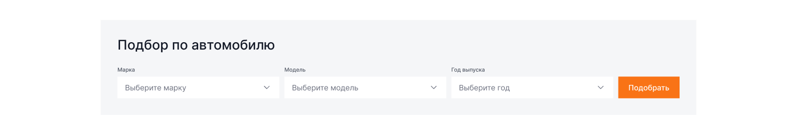
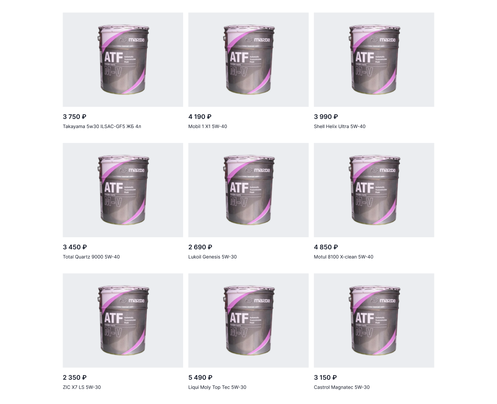
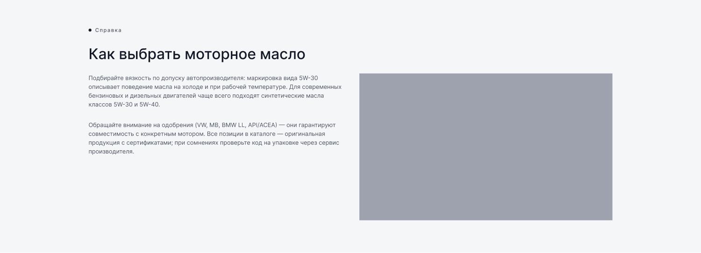

[← Оглавление](README.md)

# 06. Каталог

`26753:534` — 1900×**4971**, пример раздела «Моторные масла». Полный вид: [00-full.png](img/pages/catalog/00-full.png)

> Сверено с макетом 4 сентября 2026. Node ID секций прежние, изменились высоты: подбор по
> авто и бренды стали компактнее, сетка — ниже, футер — выше. Карточка товара в сетке
> переработана (чипсы объёма), см. [04-components.md](04-components.md#карточка-товара-тайл).

> **11 сентября 2026.** Плитки листинга — реальные товары витрины «Омск» (`data-product-id`),
> значения фильтров пересобраны по ним: «Бренд» — категории CS-Cart (CASTROL, ЛУКОЙЛ),
> «Объём» читается из `data-volume`, а не из чипсов — чипсы теперь ссылки на соседние
> товары. Подробности — [29-cscart-data-pass.md](29-cscart-data-pass.md).

| # | Секция | Node | Высота | Было |
|---|---|---|---|---|
| — | Шапка | `26753:535` | 160 | 160 |
| 1 | Хлебные крошки | `26753:615` | 68 | 68 |
| 2 | H1 | `26753:617` | 72 | 72 |
| 3 | Подбор по автомобилю | `26756:604` | 308 | 324 |
| 4 | Популярные бренды | `26756:631` | 100 | 138 |
| 5 | Найдено N товаров + сортировка | `26757:643` | 80 | 80 |
| 6 | Фильтры | `26757:608` | 177 | 137 |
| 7 | Сетка товаров | `26758:613` | 1484 | 1542 |
| 8 | Пагинация | `26846:22913` | 88 | 88 |
| 9 | Отзывы | `26844:21588` | 824 | 858 |
| 10 | SEO-блок | `26759:824` | 684 | 688 |
| 11 | Футер | `26847:23545` | 926 | 587 |

---

## 1–2. Крошки и заголовок

`Главная / Каталог / Моторные масла` — `Caption xl`, активный элемент `--ko-text-3`, ссылки — `--ko-text-2`.
H1 «Моторные масла» — `Heading 2` 64/72.

## 3. Подбор по автомобилю — 1900×308

> Скриншот от 3 сентября устарел: в макете от 4 сентября трёх селектов больше нет.

Блок на подложке `--ko-bg-1` шириной 1420, паддинг 40. Внутри: заголовок «Подбор по
автомобилю» (`Heading 5` 32/38), ниже ряд из **двух полей по 585** — «Госномер» и
«Быстрый поиск» — и кнопка «Подобрать» 146×52. Гэп между колонками 12, подпись поля 18,
до поля 8.

⚠️ У обоих полей в макете стоит один плейсхолдер «А 000 АА 000» — во втором это копия.
В вёрстке у «Быстрого поиска» подсказка «Марка, модель или артикул», уточнить у дизайнера.

## 4. Популярные бренды — 1900×100

Ряд чипов **высотой 52** без подписи сверху: Castrol, Mobil, Shell, Total, Lukoil, Motul,
ZIC, Liqui Moly. Чип — фон `--ko-bg-1`, гэп 10, снизу до строки «Найдено N» — 48.

## 5. Счётчик и сортировка — 1900×80

Слева «Найдено 128 товаров» (`Small r`), справа кнопка-дропдаун «Сортировка ⌃». В открытом виде — панель на белом фоне с тенью: По популярности / По цене / По новизне. Под строкой — разделитель `--ko-border-1`.

## 6. Фильтры — 1900×177

В макете **два ряда селектов** по 274.4×52 с гэпом 12: сверху пять (Вязкость, Тип масла,
Объём, Бренд, Допуск), снизу ещё три. Через 24 — активные фильтры чипами с крестиком
(5W-30 ✕, Синтетическое ✕, Castrol ✕) и ссылка «Сбросить» справа.

Решение от 7 сентября: **число фильтров зависит от типа продукции**, второй ряд появляется
сам, когда фильтров больше трёх. Второй ряд в макете — демонстрация этого переноса, а не
восемь разных фильтров. В вёрстке сетка на 5 колонок с гэпом 12 по обеим осям: лишние
селекты переносятся вторым рядом автоматически. Сейчас в разделе «Моторные масла» пять
фильтров, поэтому секция ниже макета на 64.

⚠️ Мобильного вида фильтров в макете нет. Стандартное решение — кнопка «Фильтры» открывает панель на весь экран. Требует согласования.

## 7. Сетка товаров — 1900×1484

> Скриншот от 3 сентября устарел: было 3 × 460, стало 4 × 340.

Контейнер 1420, внутри сетка **4 × 340** в три ряда, гэп по горизонтали **20**, по вертикали
**48**, сверху и снизу секции по 40. Карточка — вариант Mini 340×436.

Не показаны в макете, но нужны в вёрстке: состояние загрузки, пустой результат («ничего не найдено»), карточка без изображения.

## 8. Пагинация — 1900×88

Слева первичная кнопка **«Показать ещё» 150×48**, справа страницы: квадратные кнопки 48×48
с гэпом 8, активная — оранжевая с белым текстом, остальные — белые с рамкой. Многоточие,
последняя страница (12), ссылка «Дальше →».

## 9. Отзывы

Тот же компонент, что и на главной — см. [04-components.md](04-components.md#отзывы).

## 10. SEO-блок — 1900×688

Подложка `--ko-bg-1` на всю ширину. Слева: надзаголовок «▪ Справка», H3 «Как выбрать моторное масло», два абзаца `Base r ⭥` 18/28. Справа — изображение (в макете плейсхолдер `--ko-bg-3`).

Это стандартный SEO-текст под категорией — в CS-Cart он приходит из описания категории, значит должен поддерживать произвольную разметку (списки, подзаголовки, ссылки).

## Фильтры: выбранное — тегами (7 сентября 2026)

Подпись селекта всегда остаётся названием фильтра («Вязкость», «Бренд»): выбранные значения
перечисляются тегами под строкой фильтров, а не внутри кнопки — иначе в узкой кнопке
получалось «1 л, 4 л +1» и было не видно, какой это фильтр.

Теги собирает `js/main.js` по отмеченным чекбоксам, снятие тега снимает чекбокс. Ссылка
«Сбросить» показывается только когда есть выбранные фильтры и прячется вместе с тегами.

## SEO-блок: фото из макета (7 сентября 2026)

Плейсхолдер в правой колонке заменён на фотографию из макета (узел `26844:21675`,
выгружена через Figma MCP) — `src/img/seo-oil-change.jpg`, кадр 686×400.

Сертификаты на главной и «О компании» тоже больше не плейсхолдеры: картинки вырезаны из
макета (`figma-refs/v2-main-certs.png`) и лежат в `src/img/certificates/`. Это временная
заглушка дизайнера («Certificate of appreciation / Name Surname») — заменить на реальные
сертификаты дистрибьюторов.

---

## Обновлено 10 сентября

- **Блок «Подбор по автомобилю» снят** по просьбе заказчика: убраны разметка на странице
  категории и стили `.car-picker` в `catalog.css`. В макете (`26756:604`) блок остаётся.
- **Фильтры, сортировка и страницы заработали** на стороне браузера: у карточек появились
  свойства (вязкость, тип, бренд, допуск), объём берётся из чипсов. Значения фильтров
  приведены к тому, что реально есть в выдаче, стартовые галочки сняты, пагинация строится
  из числа страниц. Разбор и отклонения — в [26-logic-pass.md](26-logic-pass.md).

## Отступы листинга поправлены 10 сентября 2026

Просьба заказчика по десктопу, оба значения — **48**:

- **Бренды и H1 слипались.** Со снятым «Подбором по автомобилю» между заголовком и рядом
  чипов не осталось ничего. `.brands` получил `margin-top: 48` — симметрично уже
  выверенным 48 снизу.
- **Товары стояли слишком далеко от фильтров** — набегало 80: `.filters`
  давал 40 снизу и секция сетки ещё 40 сверху (`.section` = 80, `.section--pt-40`).
  Теперь весь отступ держит один `.filters { margin-bottom: 48 }`, а у секции в
  [category.html](../src/category.html) стоит `.section--pt-0`.

Замер в браузере, десктоп 1440: H1 → бренды 48, фильтры → сетка 48.
