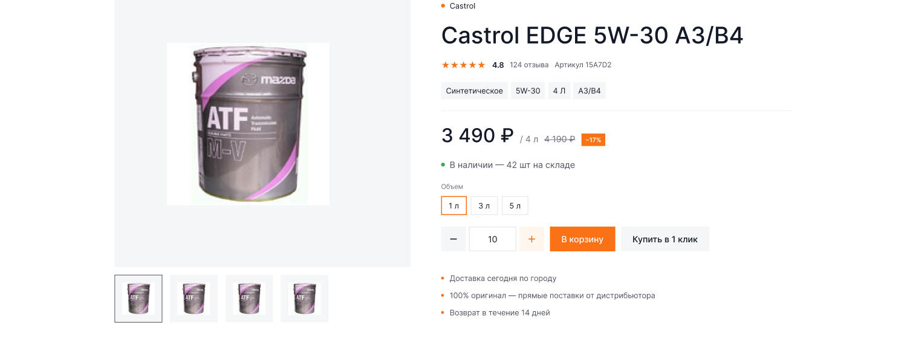
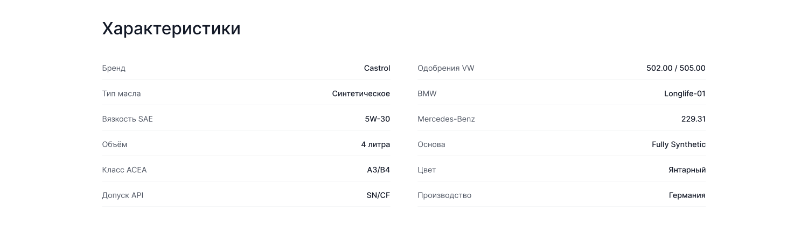
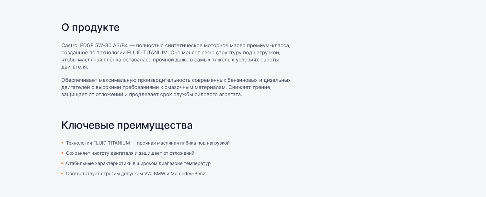
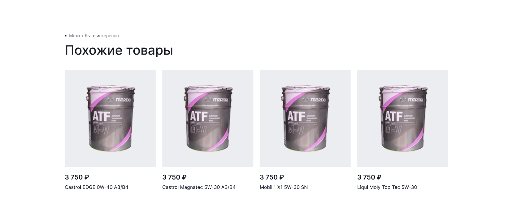

[← Оглавление](README.md)

# 07. Карточка товара

`26766:1312` — 1900×**5064**. Полный вид: [00-full.png](img/pages/product/00-full.png)

> Сверено с макетом 4 сентября 2026. Node ID прежние. Выросли «Похожие товары» — из-за новой
> карточки с чипсами объёма, см. [04-components.md](04-components.md#карточка-товара-тайл).
> ~~Выбор объёма в самом инфоблоке товара работает так же: меняет цену и артикул на месте.~~

> **Поправка 11 сентября 2026.** Карточка привязана к товару 296 CS-Cart и заполнена его
> данными. Строка «Артикул» снята (артикулов в каталоге нет), чужой объём — ссылка на
> соседний товар, текущий — подпись; наличие без числа штук; характеристики — только те,
> что есть в CS-Cart или в названии. Подробности — [29-cscart-data-pass.md](29-cscart-data-pass.md).

| # | Секция | Node | Высота | Было |
|---|---|---|---|---|
| — | Шапка | `26766:1313` | 160 | 160 |
| 1 | Хлебные крошки | `26846:22809` | 68 | 68 |
| 2 | Товар (галерея + инфоблок) | `26766:1395` | 716 | 716 |
| 3 | Характеристики | `26778:1383` | 568 | 568 |
| 4 | Описание | `26778:1428` | 772 | 772 |
| 5 | Похожие товары | `26779:1383` | 992 | 790 |
| 6 | Отзывы | `26846:22931` | 862 | 858 |
| 7 | Футер | `26847:23546` | 926 | 587 |

---

## 2. Товар — 1900×716

Две колонки: **галерея 620** (x=240) и **инфоблок 736** (x=924). Промежуток 64.

### Галерея (620×676)

- Главное изображение: фрейм 620×560 с фоном `--ko-bg-2`, картинка внутри 360×340 по центру
- Ряд превью: 4 миниатюры, фрейм 100×100 с шагом 116, изображение внутри 68×68
- Активная миниатюра — с рамкой

### Инфоблок (736×667), сверху вниз

| Y | Элемент | Размер / стиль |
|---|---|---|
| 0 | Бренд: точка 8×8 + ссылка «Castrol» | `Small r`, оранжевая |
| 48 | Название «Castrol EDGE 5W-30 A3/B4» | `Heading 3` 48/52, высота 52 |
| 124 | Рейтинг: ★★★★★ · 4.8 · 124 отзыва · Артикул 15A7D2 | `Caption xl`, звёзды оранжевые |
| 172 | Теги-характеристики: Синтетическое (140) · 5W-30 (72) · 4 Л (47) · A3/B4 (68) | высота 36, паддинг 10 |
| 232 | Разделитель 736×1 | `--ko-border-1` |
| 257 | Цена: **3 490 ₽** (153×52) · «/ 4 л» · зачёркнутая 4 190 ₽ · бейдж −17 % (50×26) | цена `Heading 3`, остальное `Small r` |
| 333 | Наличие: точка 8×8 + «В наличии — 42 шт на складе» | точка зелёная `--ko-other-1` |
| 381 | «Объем» + табы 1 л (54) / 3 л (57) / 5 л (56), высота 40, гэп 8 | активный — оранжевая рамка |
| 475 | Степпер количества (216×52) · «В корзину» (137×52) · «Купить в 1 клик» (185×52) | гэп 12 |
| 551 | 3 буллета: Доставка сегодня по городу · 100 % оригинал · Возврат в течение 14 дней | точка 6×6 оранжевая, шаг 36 |

Степпер: «−» / поле с числом / «+», плюс окрашен в оранжевый.

## 3. Характеристики — 1900×568

H3 «Характеристики», затем две таблицы рядом (по ~680 каждая, промежуток ~64). Строка: название слева (`--ko-text-2`), значение справа (`--ko-text-1`, выравнивание по правому краю), снизу линия `--ko-border-1`.

Левая колонка: Бренд, Тип масла, Вязкость SAE, Объём, Класс ACEA, Допуск API.
Правая: Одобрения VW, BMW, Mercedes-Benz, Основа, Цвет, Производство.

Набор строк должен быть динамическим — в CS-Cart это features товара.

## 4. Описание — 1900×772

Подложка `--ko-bg-1` на всю ширину. Внутри две части:
- H3 «О продукте» + два абзаца `Base r ⭥` 18/28 шириной ~800
- H3 «Ключевые преимущества» + маркированный список из 4 пунктов (маркер — оранжевая точка 6×6)

## 5. Похожие товары — 1900×790

Надзаголовок «▪ Может быть интересно», H2 «Похожие товары», 4 карточки в ряд (ширина ~335, гэп 20).

## 6. Отзывы

Тот же компонент — см. [04-components.md](04-components.md#отзывы).

---

## Чего нет в макете

- Состояние «нет в наличии» (кнопка, текст, возможность подписки на поступление)
- Товар без скидки (нужно скрывать зачёркнутую цену и бейдж)
- Товар без вариантов объёма
- Ошибка при добавлении в корзину
- Модалка «Купить в 1 клик» — по логике должна открывать форму заявки, но конкретной модалки в наборе нет. Ближайшая подходящая — `Basic form` «Заказать звонок» (`22924:23657`)

## Масштаб фотографий (7 сентября 2026)

Главное фото галереи масштабировалось по натуральной величине файла (`width/height: auto`
плюс `max-*`), поэтому снимки меньшего разрешения показывались мельче остальных: например,
`p09.jpg` — 250×250 против 556×560 у соседних кадров. Теперь размер задаёт область
(`width`/`height` минус поля 80), а вписывание — `object-fit: contain`, и все кадры
занимают одинаковые 456×396.

⚠️ Осталось на стороне контента: 34 из 112 файлов в `src/img/products` мельче 400 px по
длинной стороне, и предмет в кадре снят в разном масштабе. Для ровной сетки нужны
исходники одного формата — квадратные, от 800 px, с одинаковым полем вокруг канистры.
