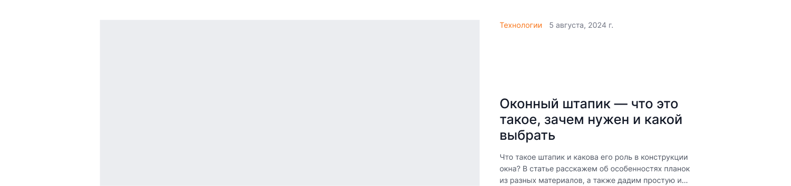
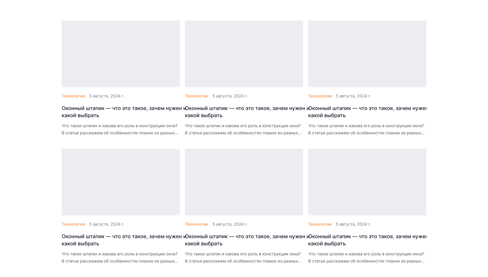

[← Оглавление](README.md)

# 08. Акции

`26780:1593` — 1900×2627. Полный вид: [00-full.png](img/pages/promo/00-full.png)

| # | Секция | Node | Высота |
|---|---|---|---|
| — | Шапка | `26780:1594` | 160 |
| 1 | Хлебные крошки | `26780:1674` | 72 |
| 2 | H1 «Акции» | `26780:1676` | 72 |
| 3 | Главная статья (featured) | `26780:1682` | 448 |
| 4 | Сетка статей | `26781:1664` | 1080 |
| 5 | Пагинация | `26846:22895` | 208 |
| 6 | Футер | `26846:23237` | 587 |

---

## 3. Главная статья — 1900×448

Горизонтальная карточка: слева изображение ~555×250 (в макете плейсхолдер `--ko-bg-2`), справа рубрика (оранжевая) + дата, заголовок `Heading 5` 32/38 в три строки, лид `Small r` в три строки с многоточием.

## 4. Сетка статей — 1900×1080

3 колонки × 2 ряда. Карточка: изображение (соотношение примерно 16:9) → рубрика + дата → заголовок в две строки → лид в две строки.

⚠️ В макете заголовки карточек не обрезаются и налезают друг на друга — тексты длиннее, чем помещается в колонку. В вёрстке нужно ограничивать заголовок двумя строками через `line-clamp` и добавлять многоточие.

## 5. Пагинация — 1900×208

Та же, что в каталоге: 1 2 3 4 … 12 «Дальше →».

---

## Чего нет в макете

- **Страницы самой статьи** (детальная страница акции / поста). Есть только листинг. Если она нужна — макет придётся запрашивать или собирать из компонентов `Article card` и типографики.
- Фильтра по рубрикам, хотя рубрика («Технологии») в карточках выводится.
- Пустого состояния — «акций пока нет».
