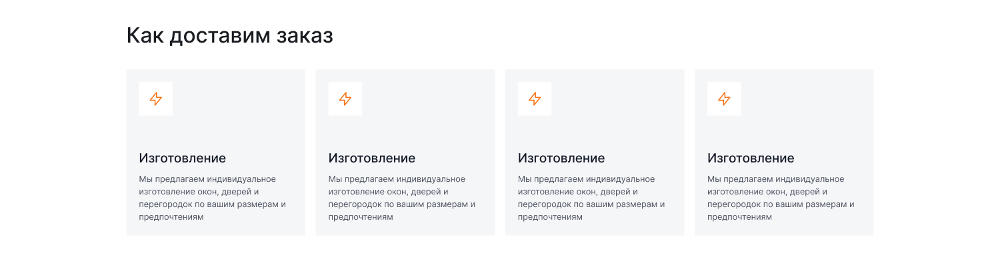
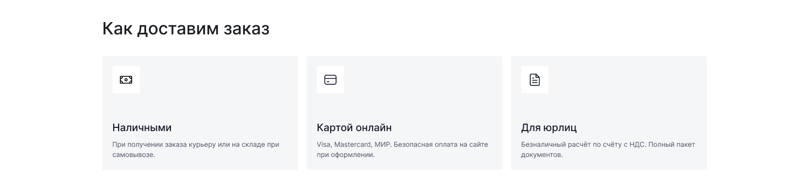
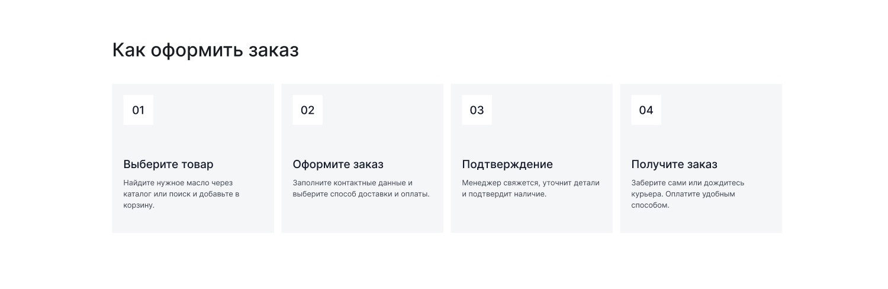
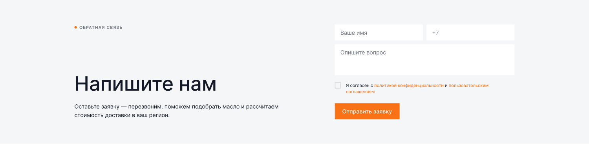

[← Оглавление](README.md)

# 09. Доставка и оплата («Как купить»)

`26783:1725` — 1900×**4048**. Полный вид: [00-full.png](img/pages/delivery/00-full.png)

> Сверено с макетом 4 сентября 2026. H1 стал отдельной секцией `Sec / Intro` высотой 72,
> карточки доставки и оплаты подросли, FAQ переехал на общий компонент.

| # | Секция | Node | Высота | Было |
|---|---|---|---|---|
| — | Шапка | `26783:1726` | 160 | 160 |
| 1 | Хлебные крошки | `26847:25136` | 72 | 72 |
| 2 | H1 «Как купить» | `26847:25138` | 72 | 120 |
| 3 | Как доставим заказ — 4 карточки | `26783:1816` | 552 | 488 |
| 4 | Как оплатить — 3 карточки | `26847:25650` | 520 | 440 |
| 5 | Как оформить заказ — 4 шага | `26847:25714` | 620 | 620 |
| 6 | «Остались вопросы?» — форма | `26847:25751` | 468 | 468 |
| 7 | FAQ «Частые вопросы» | `26900:27283` | 658 | 738 (`26846:23022`) |
| 8 | Футер | `26847:23547` | 926 | 587 |

---

## 3. Способы доставки — 1900×488

H3 «Как доставим заказ», ниже 4 карточки в ряд (~340 ширина, гэп 20). Карточка: подложка `--ko-bg-1`, внутри белый квадрат 40×40 с оранжевой иконкой, заголовок `Heading 6`, описание `Caption xl` цветом `--ko-text-2`.

⚠️ Контент карточек — из проекта по окнам («Изготовление окон, дверей и перегородок»), все четыре одинаковые. Нужны реальные способы доставки.

## 4. Оплата — 1900×440

Тот же паттерн, 3 карточки: **Наличными** (при получении курьеру или на складе при самовывозе), **Картой онлайн** (Visa, Mastercard, МИР — безопасная оплата на сайте при оформлении), **Для юрлиц** (безналичный расчёт по счёту с НДС, полный пакет документов).

Заголовок секции в макете снова «Как доставим заказ» — **опечатка**, должно быть «Как оплатить».

## 5. Как оформить заказ — 1900×620

H3 «Как оформить заказ», 4 карточки-шага. В каждой: номер в белом квадрате (01, 02, 03, 04), заголовок, описание.
Шаги: Выберите товар → Оформите заказ → Подтверждение → Получите заказ.

## 6. Форма «Напишите нам» — 1900×468

Подложка `--ko-bg-1` на всю ширину. Две колонки:
- **Слева:** надзаголовок «● ОБРАТНАЯ СВЯЗЬ» (оранжевый, капслок, `Caption`), H2 «Напишите нам», абзац-подводка
- **Справа:** форма — поля «Ваше имя» и «+7» в ряд, textarea «Опишите вопрос», чекбокс согласия со ссылками (политика конфиденциальности, пользовательское соглашение), кнопка «Отправить заявку»

Поля на белом фоне (не `--ko-bg-1`, потому что вся секция уже серая).

Эта же секция используется на странице «Контакты» — верстаем один переиспользуемый блок.

## 7. FAQ — 1900×738

Слева надзаголовок «▪ Ассортимент» + H2 «Частые вопросы», справа аккордеон из 6 пунктов. Компонент — см. [04-components.md](04-components.md#faq-аккордеон).

⚠️ Надзаголовок «Ассортимент» над блоком вопросов о доставке выглядит ошибкой копипаста — уточнить.

## Разделы подвала стали отдельными страницами (7 сентября 2026)

Раньше «Как купить», «Доставка», «Оплата» и «Возврат и обмен» в подвале вели на одну
страницу `delivery.html` с якорями. Теперь это четыре самостоятельные страницы со своим
содержанием, общей структурой (крошки → H1 → подводка → секции → форма «Остались
вопросы?» → FAQ) и своим набором вопросов в FAQ:

| Страница | О чём |
|---|---|
| `how-to-buy.html` | четыре шага до заказа, где оформить покупку, что происходит после оформления, подбор масла, условия для организаций |
| `delivery.html` | способы доставки, таблица сроков и стоимости, пункты самовывоза, бесплатная доставка от 5000 ₽, как получить заказ |
| `payment.html` | шесть способов оплаты, как проходит оплата картой, оплата для организаций, баллы и возврат денег |
| `returns.html` | условия возврата за 14 дней, порядок оформления, брак и пересорт, что вернуть нельзя |

Фактура — с тестового сайта и из прежней страницы «Как купить»; чего на сайте не было
(список 22 городов, условия для юрлиц, сроки экспертизы) — дописано и помечено `TODO`
(список городов 11 сентября 2026 заменён на боевой со страницы «Оплата и доставка»
king-oil.ru, см. [29-cscart-data-pass.md](29-cscart-data-pass.md))
в разметке, требует подтверждения заказчика.

Новые компоненты: `.data-table` в обёртке `.table-scroll` (таблица тарифов), `.text-block`
(текстовая колонка 900 с подзаголовками и списками — те же правила, что у `.legal`),
`.page-head__lead` (подводка под H1).

Заголовки секций на этих страницах — `Heading 5` 32/38 (не `Heading 3` 48/52, как на
главной): страницы текстовые, крупные заголовки перебивали содержание. H1 остаётся 64.
Ритм секций — 50 сверху и снизу, у последнего блока перед формой снизу 120, FAQ под формой
начинается с отступа 120.
