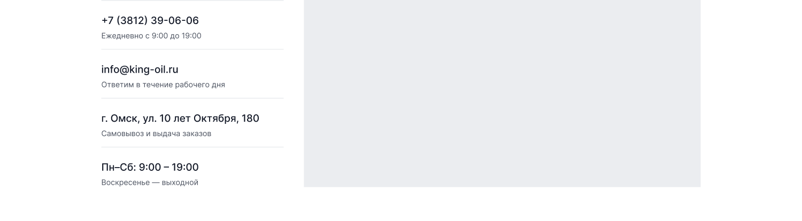

[← Оглавление](README.md)

# 10. Контакты

`26785:1856` — 1900×3141. Полный вид: [00-full.png](img/pages/contacts/00-full.png)

| # | Секция | Node | Высота |
|---|---|---|---|
| — | Шапка | `26785:1857` | 160 |
| 1 | Хлебные крошки | `26785:1937` | 72 |
| 2 | H1 «Контакты» | `26847:25193` | 120 |
| 3 | Контакты + карта | `26785:1947` | 524 |
| 4 | Реквизиты компании | `26847:25148` | 472 |
| 5 | Форма «Напишите нам» | `26847:25069` | 468 |
| 6 | FAQ | `26847:25093` | 738 |
| 7 | Футер | `26847:23548` | 587 |

---

## 3. Контакты и карта — 1900×524

Две колонки: слева список контактов (~340 ширина), справа карта (~1020×250, в макете плейсхолдер `--ko-bg-2`).

Список — 4 блока, разделённых линиями. В каждом: значение крупно (`Heading 6` 24/32) и подпись под ним (`Caption xl`, `--ko-text-3`):

| Значение | Подпись |
|---|---|
| +7 (3812) 39-06-06 | Ежедневно с 9:00 до 19:00 |
| info@king-oil.ru | Ответим в течение рабочего дня |
| г. Омск, ул. 10 лет Октября, 180 | Самовывоз и выдача заказов |
| Пн–Сб: 9:00 – 19:00 | Воскресенье — выходной |

⚠️ Карта — плейсхолдер. Нужно решить, что встраиваем: Яндекс.Карты (для РФ логичнее) или 2ГИС. Также непонятно, показываются ли на карте все 4 точки самовывоза или только одна.

## 4. Реквизиты компании — 1900×472

Слева H2 «Реквизиты компании» в две строки, справа таблица со строками-зеброй (чётные — `--ko-bg-1`):

| Организация | ООО «Кинг Ойл» |
|---|---|
| ОГРН | 1205500023556 |
| ИНН / КПП | 5501234567 / 550101001 |
| Расчётный счёт | 4070 2810 1234 5678 9012 |

⚠️ Реквизиты в этой таблице **не совпадают** с реквизитами в футере (там ООО «Сити Ойл», ОГРН 1205500020318, ИНН 5503193478). Нужны настоящие данные — см. [13-open-questions.md](13-open-questions.md).

## 5. Форма «Напишите нам»

Тот же блок, что на странице доставки — см. [09-page-delivery.md](09-page-delivery.md#6-форма-напишите-нам--1900468).

## 6. FAQ

Тот же аккордеон — см. [04-components.md](04-components.md#faq-аккордеон).
