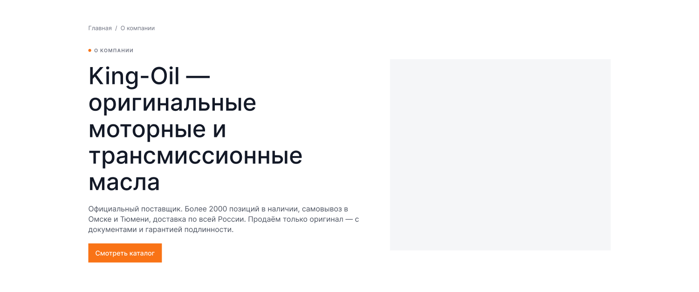
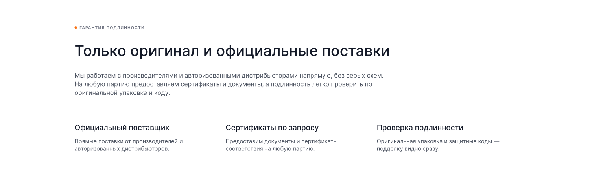
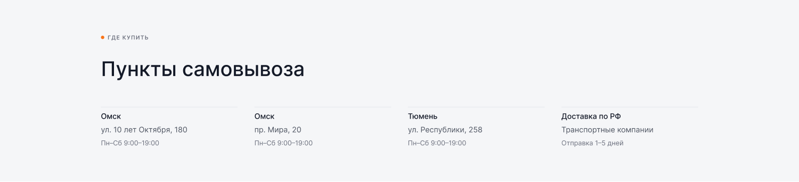

[← Оглавление](README.md)

# 11. О компании

`26850:5334` — 1900×**7436**. Полный вид: [00-full.png](img/pages/about/00-full.png)
Мобильная версия — `26900:26483`, 375×6957, см. [18-mobile.md](18-mobile.md).

> Обновлено 4 сентября 2026. Страница переписана заново: было 3143, стало 7436, все node ID
> сменились. Прежней раскладки (герой в две колонки, «Гарантия подлинности», «Пункты
> самовывоза», тонкая тёмная CTA-полоса) больше нет.

| # | Секция | Node | Высота |
|---|---|---|---|
| — | Шапка | `26850:5335` | 160 |
| 1 | Хлебные крошки | `26899:22688` | 72 |
| 2 | Герой с фото магазина | `26899:22692` | 1562 |
| 3 | Цифры (бенто) | `26899:22709` | 1040 |
| 4 | Сертификаты | `26899:22762` | 706 |
| 5 | Цитата | `26899:22900` | 800 |
| 6 | Отзывы | `26900:27042` | 782 |
| 7 | Филиалы | `26899:22817` | 920 |
| 8 | «Остались вопросы?» — форма | `26899:22739` | 468 |
| 9 | Футер | `26851:5402` | 926 |

Хлебные крошки — как на всех остальных страницах: прямо в `
`,
без обёртки `<section>`. Обёртка была лишней — её `section--pt-24` складывался с
`padding-top` самих крошек и давал 48 сверху вместо 24 по макету (`26899:22688`).
Исправлено 7 сентября 2026, см. [04-components.md](04-components.md).

---

## 2. Герой — 1900×1562

Две части.

**Текстовый блок по центру** (ширина текста ~800, выключка по центру):
- H2 в четыре строки: **«King-Oil — оригинальные моторные и трансмиссионные масла»**
- лид `Base r ⭥` в три строки: «Официальный поставщик. Более 2000 позиций в наличии, самовывоз в Омске и Тюмени, доставка по всей России. Продаём только оригинал — с документами и гарантией подлинности.»
- две кнопки в ряд по центру: оранжевая **«Смотреть каталог»** и вторичная серая **«Подробнее»**

**Фото на всю ширину экрана** (не в контейнере) — настоящая фотография магазина King-Oil:
тёмный фасад с объёмной вывеской «King-Oil» и надписями «СВЕЧИ», «МАСЛА ФИЛЬТРЫ»,
витрины, вечерний свет. Высота ~800. Изображение нужно выгрузить из макета.

## 3. Цифры — 1900×1040

Тот же бенто-блок, что на главной, см. [05-page-main.md](05-page-main.md#4-магазин-в-цифрах--1900×1040).

## 4. Сертификаты — 1900×706

Тот же блок, что на главной: надзаголовок «▪ Профи не только на словах», H3 «Сертификаты
и гарантии», карусель из 7 карточек, полоса прогресса и стрелки. На 40 px ниже, чем на
главной, за счёт меньшего нижнего отступа.

## 5. Цитата — 1900×800

Подложка `--ko-bg-1` во всю ширину, содержимое по центру:
- белый квадрат 60×60 с иконкой кавычек `❞`
- H3 в две строки по центру
- абзац в две строки по центру, ширина ~680

⚠️ В макете Lorem ipsum. По решению от 4 сентября текст пишем сами — короткое высказывание
о компании (20+ лет на рынке, только оригинал, свой склад).

## 6. Отзывы — 1900×782

Та же карусель отзывов 2ГИС, что на главной, см. [05-page-main.md](05-page-main.md#7-отзывы-покупателей--1900×822).

## 7. Филиалы — 1900×920

Две колонки внутри контейнера.

**Слева** (ширина ~460):
- H3 «Филиалы»
- телефон крупно (`Heading 5` 32/38)
- две строки режима работы (`Caption xl`, `--ko-text-3`)
- e-mail оранжевой ссылкой
- список адресов с шагом 35 (`Base r`)
- ряд кнопок: оранжевая **«Заказать звонок»**, затем две квадратные 36×36 на `--ko-bg-1` — Telegram и WhatsApp

**Справа** — прямоугольник 604×530, залит коричнево-рыжим `#7B2E12`. Это заглушка под
карту или фото точек. В вёрстке ставим интерактивную карту точек выбранного города — так же,
как на «Контактах».

⚠️ Контакты в этой секции в макете свои: телефон «+7 800 675 45 43», почта «mail@gmail.com»,
режим «ПН-ПТ с 9:00 до 18:00, СБ и ВС — выходной». Это рыба, не совпадающая ни с шапкой,
ни с футером, ни с «Контактами». Ставим боевые: телефон города, почту витрины (с 11 сентября 2026 — `king-oil@yandex.ru`),
режим «Пн–Сб 9:00–20:00, Вс 10:00–19:00» и три омских адреса + тюменский.

## 8. «Остались вопросы?»

Общая секция `CTA / 14 /`, см. [05-page-main.md](05-page-main.md#9-остались-вопросы--1900×468).
