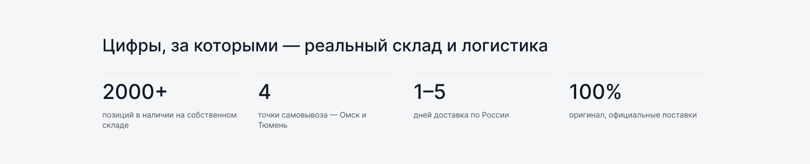

[← Оглавление](README.md)

# 11. О компании

`26850:5334` — 1900×3143. Полный вид: [00-full.png](img/pages/about/00-full.png)

| # | Секция | Node | Высота |
|---|---|---|---|
| — | Шапка | `26850:5335` | 160 |
| 1 | Герой | `26850:5411` | 794 |
| 2 | Цифры | `26850:5425` | 386 |
| 3 | Гарантия подлинности | `26850:5447` | 572 |
| 4 | Пункты самовывоза | `26850:5466` | 432 |
| 5 | Тёмная CTA-полоса | `26850:5492` | 212 |
| 6 | Футер | `26851:5402` | 587 |

Единственная страница без хлебных крошек в отдельной секции — крошки входят в первый блок.

---

## 1. Герой — 1900×794

Две колонки. Слева: крошки, надзаголовок «● О КОМПАНИИ» (оранжевый капслок), H2 «King-Oil — оригинальные моторные и трансмиссионные масла» в 5 строк, абзац, кнопка «Смотреть каталог». Справа — изображение ~340×280 (плейсхолдер).

## 2. Цифры — 1900×386

Подложка `--ko-bg-1`. H3 «Цифры, за которыми — реальный склад и логистика», ниже 4 колонки, разделённые вертикально: число (`Heading 3` 48/52) и подпись под ним (`Caption xl`, `--ko-text-2`). Над каждой колонкой — линия `--ko-border-1`.

2000+ позиций · 4 точки самовывоза · 1–5 дней доставка по России · 100 % оригинал.

## 3. Гарантия подлинности — 1900×572

Надзаголовок «● ГАРАНТИЯ ПОДЛИННОСТИ», H3 «Только оригинал и официальные поставки», абзац на ~660 ширины, ниже 3 колонки: заголовок (`Base m`) + описание (`Caption xl`), над каждой линия.

## 4. Пункты самовывоза — 1900×432

Подложка `--ko-bg-1`. Надзаголовок «● ГДЕ КУПИТЬ», H3 «Пункты самовывоза», 4 колонки: город (`Base m`) → адрес (`--ko-text-2`) → режим работы (`--ko-text-3`). Последняя колонка — «Доставка по РФ / Транспортные компании / Отправка 1–5 дней».

## 5. Тёмная CTA-полоса — 1900×212

Фон `--ko-bg-4` на всю ширину. Слева заголовок H3 «Готовы подобрать масло для вашего авто?» и подпись под ним, справа кнопка «Перейти в каталог» (оранжевая).

Полезный переиспользуемый блок — стоит вынести в отдельный компонент вёрстки.

---

Единственная страница, где контент полностью написан под King-Oil, без рыбы и чужих плейсхолдеров. Хороший ориентир по тону текстов для остальных страниц.
