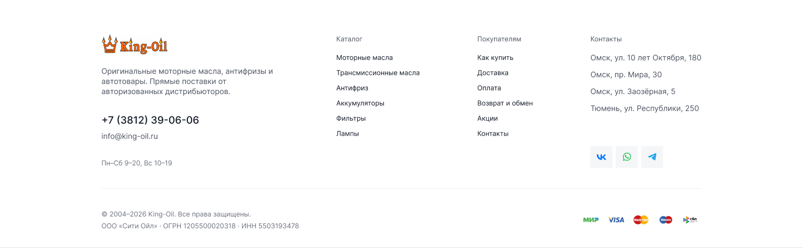
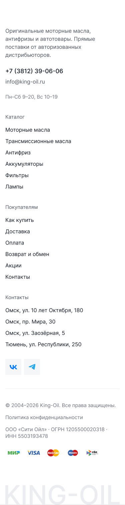

[← Оглавление](README.md)

# 12. Футер

Компонент — `Property 1=Footer (King-Oil)`, `26846:23236`, 1900×**974**.
На страницах лежит инстансом высотой **926** (`26899:23133` на главной, `26847:23545`
в каталоге, `26847:23548` на контактах и т. д.) — нижние 48 px водяного знака обрезаются.
Мобильный вариант — `Property 1=Variant2`, на главной инстанс `26900:23412`, 375×1510.

> Обновлено 4 сентября 2026. Футер переделан: было 587, стало 926. Убрали логотип, добавили
> водяной знак «KING-OIL», соцсетей стало две, нижняя строка разъехалась на два ряда.

## Что изменилось

| Было | Стало |
|---|---|
| Логотип 160×52 в первой колонке | Логотипа нет, колонка начинается с описания |
| VK · WhatsApp · Telegram | **VK · Telegram** (WhatsApp убран) |
| Соцсети в колонке «Контакты» справа | Там же, под адресами: 2 кнопки 52×52 с гэпом 8 |
| «Покупателям» — 6 ссылок | **8 ссылок**: добавились «Бонусные баллы» и «Отзывы» |
| Нижняя строка в одну полосу | Два ряда: © и «Политика конфиденциальности», ниже реквизиты |
| — | **Водяной знак «KING-OIL»** во всю ширину контейнера под футером |

## Геометрия

Контейнер 1420 (x = 240), верхний отступ **120**. Блок колонок — 1420×320,
под ним разделитель на y=344, строка копирайта на y=369, нижняя строка на y=417.

| Колонка | X (внутри контейнера) | Ширина |
|---|---|---|
| Бренд | 0 | 420 |
| Каталог | 556 | 198 |
| Покупателям | 889 | 132 |
| Контакты | 1157 | 263 |

## Колонка «Бренд» — 420×242

| Y | Элемент | Стиль |
|---|---|---|
| 0 | Описание в 3 строки: «Оригинальные моторные масла, антифризы и автотовары. Прямые поставки от авторизованных дистрибьюторов.» | `Small r`, `--ko-text-2` |
| 112 | Телефон «+7 (3812) 39-06-06» | `Heading 6` 24/32, `--ko-text-1` |
| 154 | E-mail «info@king-oil.ru» (с 11 сентября 2026 — `king-oil@yandex.ru`, реквизиты витрины) | `Small r`, `--ko-text-2` |
| 218 | Режим «Пн–Сб 9–20, Вс 10–19» | `Small r`, `--ko-text-3` |

Телефон переключается вместе с городом (Омск / Тюмень), см. решение №16 в
[13-open-questions.md](13-open-questions.md).

## Колонки-меню

Заголовок колонки (`Small r`, `--ko-text-3`), под ним отступ 44, дальше ссылки с шагом **36**.

**Каталог** (6 ссылок, колонка 198): Моторные масла · Трансмиссионные масла · Антифриз · Аккумуляторы · Фильтры · Лампы

**Покупателям** (8 ссылок, колонка 132): Как купить · **Бонусные баллы** · Доставка · Оплата · Возврат и обмен · **Отзывы** · Акции · Контакты

Две ссылки — «Бонусные баллы» и «Отзывы» — дизайнер добавил 4 сентября. Ведут на раздел
программы лояльности в кабинете ([19-account.md](19-account.md)) и на страницу
[reviews.html](17-page-reviews.md).

⚠️ Инстансы футера на страницах отрисованы со старым составом колонки (6 ссылок) —
актуален компонент `26846:23236`.

## Колонка «Контакты»

Колонка 263×320. Заголовок на y=24, отступ 44, затем 4 адреса с шагом **40**.
На y=244 — соцсети: 2 кнопки **52×52** с гэпом 8 (общая ширина 112), фон `--ko-bg-1`,
иконки цветные — VK и Telegram.

⚠️ В макете тут стоят адреса «Омск, ул. 10 лет Октября, 180 · Омск, пр. Мира, 30 · Омск,
ул. Заозёрная, 5 · Тюмень, ул. Республики, 250». Это рыба. Боевые адреса (решение от
4 сентября): **Омск, ул. Герцена, 197а · Омск, ул. Енисейская, 1 · Омск, ул. Энтузиастов, 2/2 ·
Тюмень, ул. 50 лет Октября, 211**.

## Нижняя часть

Разделитель 1420×1 на y=344, под ним два ряда:

1. **y=369:** «© 2004–2026 King-Oil. Все права защищены.» (354 ширины) и на x=402 ссылка
   «Политика конфиденциальности» (249)
2. **y=417:** слева «ООО «Сити Ойл» · ОГРН 1205500020318 · ИНН 5503193478» (468),
   справа на x=1133 — 5 иконок платёжных систем 51×32 с шагом 59: МИР, VISA, Mastercard,
   Maestro, СБП

Реквизиты в нижней строке — настоящие, их и берём (решение от 4 сентября). Год «2026»
в макете захардкожен, в вёрстке ставим динамический.

## Водяной знак

Под нижней строкой — надпись **KING-OIL**: вектор 1420×245 на y=729, во всю ширину
контейнера, цвет близок к `--ko-bg-1` (чуть темнее фона). Компонент высотой 974, инстанс на
странице — 926, то есть нижние 48 px букв срезаются краем страницы.

В вёрстке делаем текстом с `overflow: hidden` у контейнера, а не картинкой, чтобы
масштабировался по ширине.

## Мобильная версия — 375×1510

Всё в один столбец с полями 16, без аккордеонов:
описание → телефон → e-mail → режим → «Каталог» со списком → «Покупателям» со списком →
«Контакты» с адресами → соцсети → разделитель → © → «Политика конфиденциальности» →
реквизиты в две строки → платёжные иконки → водяной знак.

## Куда ведут ссылки «Покупателям» (7 сентября 2026)

| Пункт | Ссылка |
|---|---|
| Как купить | `how-to-buy.html` |
| Бонусные баллы | `account.html#loyalty` |
| Доставка | `delivery.html` |
| Оплата | `payment.html` |
| Возврат и обмен | `returns.html` |
| Отзывы | `reviews.html` |
| Акции | `promo.html` |
| Контакты | `contacts.html` |

Ссылки разделов в подвале — чёрные (`--ko-text-1`), оранжевые на наведении.

## Нижняя строка (7 сентября 2026)

Ряд с иконками платёжных систем убран, а реквизиты переехали в строку копирайта и прижаты
к правому краю — напротив ссылки на политику конфиденциальности:

`© 2004–2026 King-Oil. Все права защищены. · Политика конфиденциальности ……… ООО «Сити Ойл» · ОГРН 1205500020318 · ИНН 5503193478`

На мобильном строка разворачивается в колонку (`margin-left` у реквизитов снимается).
Файлы `img/icons/pay-*.svg` остались в проекте — из разметки они просто не используются.
