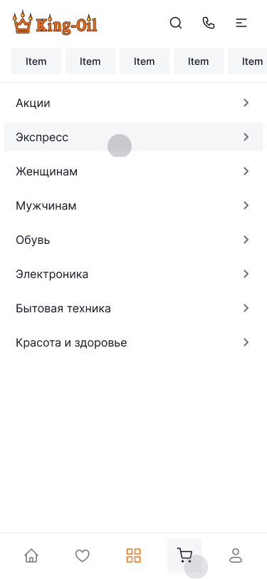
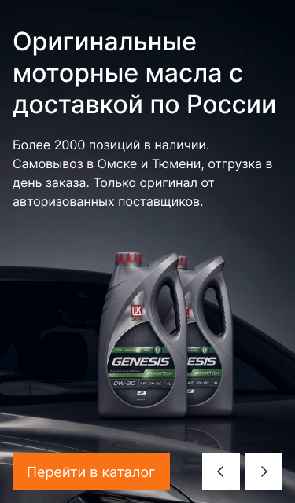
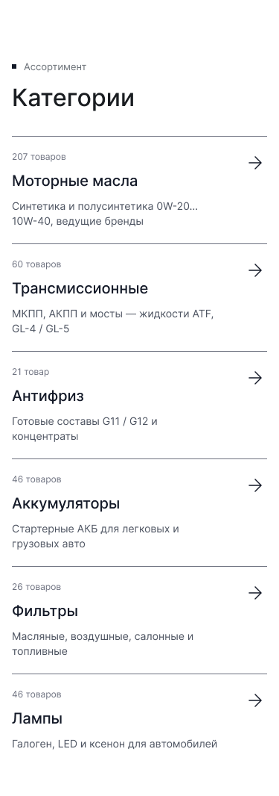
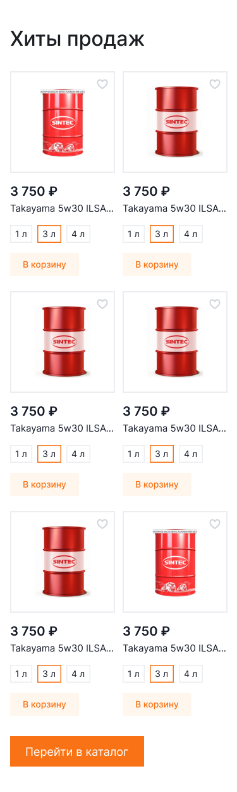
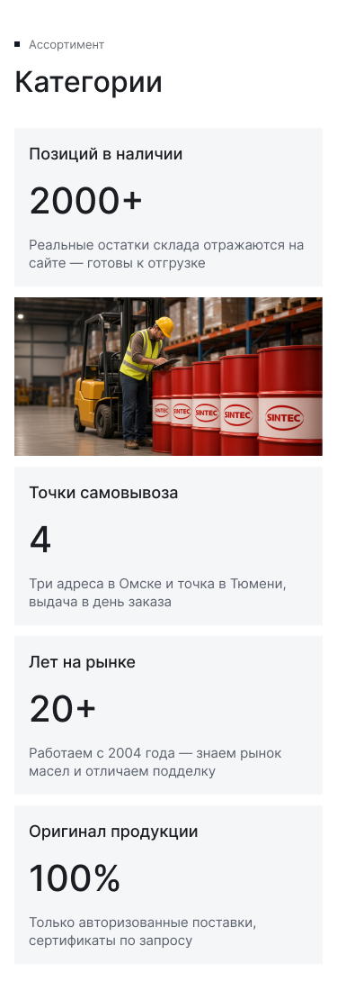
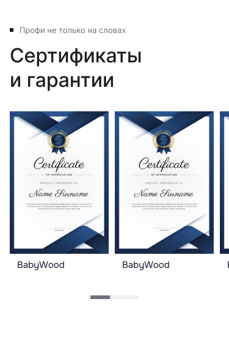
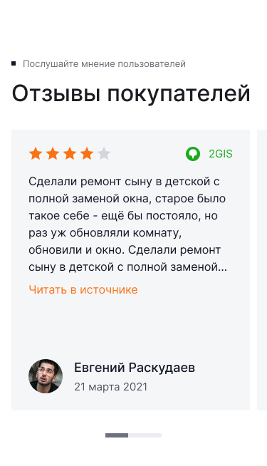
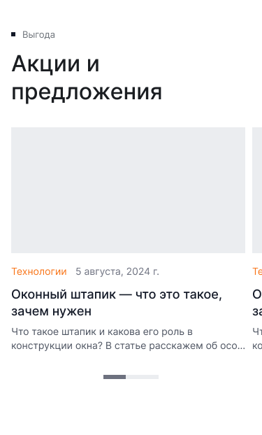
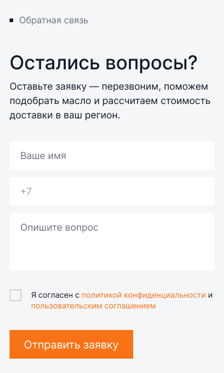

[← Оглавление](README.md)

# 18. Мобильные макеты — 375

Появились 4 сентября 2026. Дизайнер собрал две страницы целиком и два служебных кадра,
«чтобы показать основные блоки». Остальные страницы на мобильном выводим сами по этим правилам.

| Кадр | Node | Размер |
|---|---|---|
| Главная — mobile | `26886:5536` | 375×8986 |
| О компании — mobile | `26900:26483` | 375×6957 |
| Главная с таббаром | `26886:5721` | 375×812 |
| Главная с открытым каталогом | `26900:24412` | 375×812 |

Артборд 375, боковые поля **16**, контейнер 343.

---

## Шапка — 375×116

`Mobile header`, два ряда:
1. логотип King-Oil слева, справа три иконки 24×24 с шагом 46: поиск, телефон, бургер
2. горизонтальная лента чипсов-категорий (скроллится), чипс — подложка `--ko-bg-1`, высота 36

## Таббар — 376×64

`Tabbar` (`1910:8134`), прилипает к низу экрана. Пять иконок: главная, избранное,
**каталог (оранжевая, активная)**, корзина, профиль. Фон белый, верхняя граница `--ko-border-1`.

## Открытый каталог — 375×812

Меню занимает весь экран под шапкой: список разделов, строка 48, справа шеврон `›`,
нажатая строка подсвечивается `--ko-bg-1`. Таббар остаётся видимым.

⚠️ В макете список заполнен чужим контентом («Женщинам», «Мужчинам», «Обувь», «Электроника»).
Ставим наши разделы и бренды — решение №1.

---

## Главная — 375×8986

| # | Секция | Node | Высота |
|---|---|---|---|
| — | Шапка | `26886:5537` | 116 |
| 1 | Слайдер | `26886:5598` | 640 |
| 2 | Категории | `26886:5628` | 1066 |
| 3 | Хиты продаж | `26886:5930` | 1246 |
| 4 | Магазин в цифрах | `26886:6049` | 1110 |
| 5 | Сертификаты | `26899:11522` | 569 |
| 6 | Подбор масла (тёмная секция) | `26899:12719` | 829 |
| 7 | Отзывы | `26899:12878` | 654 |
| 8 | Акции | `26899:13048` | 622 |
| 9 | «Остались вопросы?» | `26899:23112` | 624 |
| 10 | Футер | `26900:23412` | 1510 |

> ⚠️ Имена фреймов у дизайнера скопированы («Sec / Цифры» стоит на сертификатах, отзывах и
> акциях) — ориентируйся на содержимое, а не на имя слоя.

### Слайдер — 640

Фото прижато к низу (сверху за текстом — ровная заливка `#131927`), текст поверх: H3 32/40
в три строки, лид 16/24, снизу ряд **кнопка 200 слева — две белые стрелки 48×48 справа**
(гэп 6). Поля секции 32 сверху, 16 по бокам и снизу.

> ⚠️ **Исправлено 8 сентября 2026.** Раньше здесь было написано «стрелок нет, листается
> свайпом» — это ошибка разбора: в макете `26886:5598` стрелки есть. Свайп оставлен как
> дополнительный способ листания.

### Категории — 1066

Надзаголовок и H2 сверху. Строка списка перестроена: **количество товаров уходит наверх**
(`Caption`, `--ko-text-3`), под ним название (`Heading 6`), под ним описание в две строки,
стрелка «→» справа на уровне количества. Разделители между строками.

### Хиты продаж — 1246

Сетка **2 колонки**, гэп 12, шесть карточек `Size=Mini, Mobile=Yes` (166×322). Внутри всё то
же: сердце, цена, название в одну строку с многоточием, чипсы объёма, «В корзину».
Внизу — оранжевая кнопка «Перейти в каталог» на всю ширину контейнера.

### Магазин в цифрах — 1110

Бенто разворачивается в столбик: карточка «2000+» → фото склада → «4» → «20+» → «100 %».
Порядок карточек отличается от десктопа (на десктопе «Оригинал» перед «Лет на рынке»).

⚠️ Надзаголовок и заголовок секции в макете остались от «Категорий» («▪ Ассортимент /
Категории») — это ошибка копирования, ставим «▪ Почему King-Oil / Магазин в цифрах».

### Сертификаты — 569

Заголовок в две строки, карусель: карточка ~161 ширины, видно две с половиной, полоса
прогресса по центру снизу. Стрелок нет.

⚠️ Подписи в макете — «BabyWood», рыба из чужого проекта. Ставим бренды, как на десктопе.

### Подбор масла — 829

Фото на весь экран, текст поверх сверху: H3 в три строки, абзац, оранжевая кнопка.

### Отзывы — 654

Карусель, карточка ~343 ширины, видно край следующей. Текст обрезается многоточием,
полоса прогресса снизу по центру.

### Акции — 622

Карусель карточек статей, карточка ~343, видно край следующей, полоса прогресса снизу.

### «Остались вопросы?» — 624

Подложка `--ko-bg-1`, всё в столбик: надзаголовок, H2, абзац, поля «Ваше имя», «+7»,
«Опишите вопрос» (высота 116), чекбокс согласия, оранжевая кнопка на всю ширину.

### Футер — 1510

См. [12-footer.md](12-footer.md#мобильная-версия--375×1510).

---

## О компании — 375×6957

| # | Секция | Node | Высота |
|---|---|---|---|
| — | Шапка | `26900:26484` | 116 |
| 1 | Герой | `26900:27014` | 1010 |
| 2 | Цифры | `26900:26520` | 1110 |
| 3 | Сертификаты | `26900:26544` | 529 |
| 4 | Цитата | `26900:27154` | 464 |
| 5 | Отзывы | `26900:26562` | 614 |
| 6 | Филиалы | `26900:27166` | 980 |
| 7 | «Остались вопросы?» | `26900:26582` | 624 |
| 8 | Футер | `26900:26583` | 1510 |

Герой (`Header full image - 01`): заголовок и лид по центру, две кнопки **в столбик** на всю
ширину, под ними фото магазина на всю ширину экрана. Хлебных крошек на мобильном нет.

Филиалы: сначала текстовая колонка (телефон, режим, почта, адреса, кнопки), под ней
прямоугольник карты на всю ширину.

---

## Чего в мобильных макетах нет

Каталог, карточка товара, акции, доставка, контакты, корзина, оформление, кабинет, 404,
модалки, поиск. Делаем сами по логике этих двух страниц: контейнер 343, карточки товара в
две колонки, карусели без стрелок с полосой прогресса, кнопки на всю ширину, формы в столбик.

Планшет (1024 / 768) макетов не имеет вовсе — по решению от 4 сентября выводим сами из
десктопа и мобайла и показываем на согласование.
