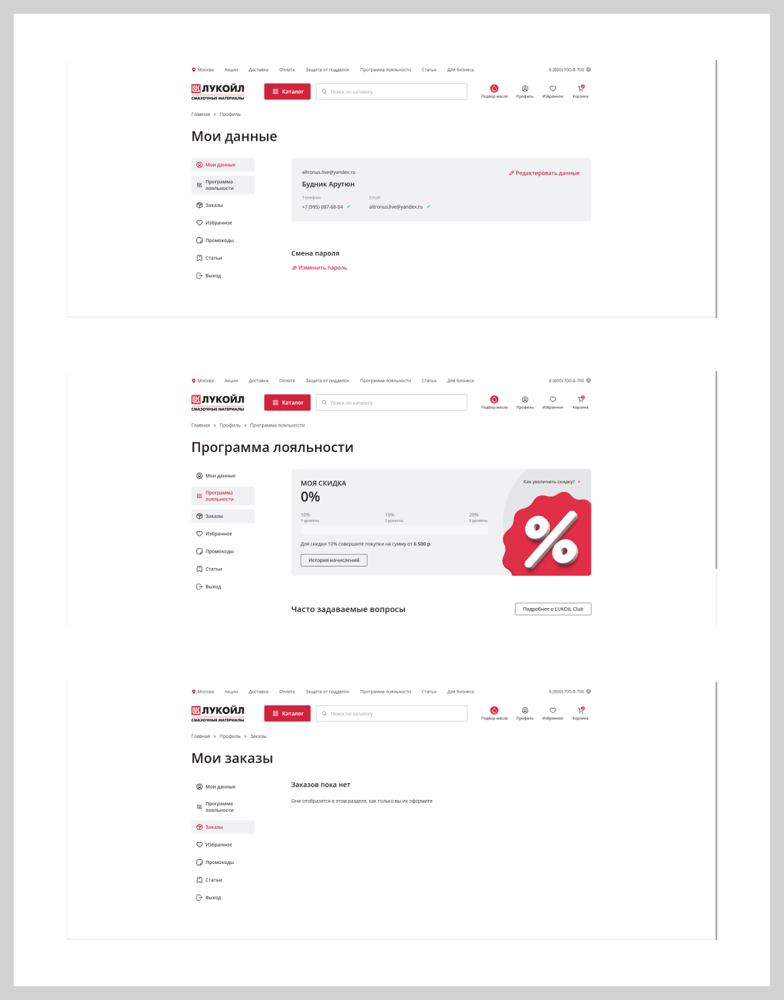

[← Оглавление](README.md)

# 19. Личный кабинет

Секция `Личный кабинет` — `26900:27422`, добавлена в макет 4 сентября 2026.

Это **не макет, а референс**: три скриншота чужого личного кабинета (сайт смазочных
материалов ЛУКОЙЛ), положенные на канву как пример структуры. Собственной отрисовки кабинета
в King-Oil-стиле в файле нет.

Решение от 4 сентября: **берём структуру со скриншотов и делаем в нашем стиле** — наша
типографика, наши токены, прямые углы, оранжевый акцент. Фирменный стиль ЛУКОЙЛа (красный,
их логотип, их скруглённые карточки) не копируем.

## Структура

Двухколоночная раскладка под хлебными крошками и H1:

**Слева — навигация**, ширина ~230, строка 44, иконка 20 + подпись:

| Пункт | Куда ведёт |
|---|---|
| Мои данные | профиль, смена пароля |
| Программа лояльности | накопленные баллы, уровни, история |
| Заказы | список заказов, пустое состояние |
| Избранное | наш существующий `wishlist.html` |
| Промокоды | список промокодов |

Активный пункт — подложка `--ko-btn-brand-soft`, иконка и текст `--ko-text-accent` (решение от 7 сентября: серая подложка не читалась как выбор).

Раздел «Статьи» из меню убран 7 сентября: сохранять материалы в кабинете King-Oil пока
некуда, пустой раздел только занимал строку.

**Справа — содержимое раздела.**

## Экраны с референса

### Мои данные

Карточка на `--ko-bg-1`: сверху e-mail мелким шрифтом, под ним имя (`Heading 6`), ниже
два поля-значения в ряд — «Телефон» и «Email», у подтверждённых стоит зелёная галочка.
Справа вверху ссылка **«Редактировать данные»** с иконкой карандаша.

Ниже отдельным блоком «Смена пароля» и ссылка **«Изменить пароль»**.

⚠️ Расхождение с референсом (решение от 7 сентября 2026): у нас справа вверху не одна
ссылка, а столбик из трёх — «Редактировать данные», «Изменить e-mail», «Изменить пароль».
Отдельный блок «Смена пароля» под карточкой убран: два действия одного рода лежат рядом,
и карточка перестаёт быть единственным содержимым раздела.

### Программа лояльности

У карточки **два состояния** (решение от 7 сентября):

1. `loyalty--offer` — карта не активирована: заголовок с предложением активировать,
   список преимуществ (баллы за позицию, оплата до 50 %, баллы не сгорают, цена карты)
   и кнопка «Активировать карту».
2. `loyalty--active` — карта активна: баллы крупной цифрой, отметка «Карта активна»,
   три шага программы и условия.

Оранжевая панель с огромным процентом убрана — она была из референса ЛУКОЙЛа и занимала
треть блока. Кнопка «Подробнее об акциях» переехала внутрь карточки и стала ссылкой рядом
с «Историей начислений». Заголовок «Часто задаваемые вопросы» — `Heading 6`
(`.account__block-title--lg`).

#### Референс

Широкая карточка: слева надпись «МОЯ СКИДКА» капслоком, под ней процент крупно
(`Heading 2`), под ним три уровня в ряд с полосой прогресса, ниже строка «Для скидки 10 %
совершите покупки на сумму от … ₽» и вторичная кнопка **«История начислений»**. Справа —
крупная иллюстрация процента.

Ниже — заголовок «Часто задаваемые вопросы» и справа кнопка со ссылкой на подробные условия.

### Заказы

Вместо таблицы — карточки (решение от 7 сентября). Карточка залита `--ko-bg-1`, кликабельна
целиком (ведёт на `order.html`), на наведении подложка темнеет до `--ko-bg-2` (без обводки),
справа по центру стрелка 24 вместо ссылки «Подробнее». Внутри:

1. номер заказа и статус рядом с ним;
2. строка деталей одной строкой: дата · количество товаров · способ получения · сумма;
3. превью товаров — белые плитки 56 с обводкой, первые три, остальные счётчиком «+N»
   (счётчик на такой же белой плитке).

Пустое состояние: заголовок «Заказов пока нет» и подпись «Они отобразятся в этом разделе,
как только вы их оформите».

Страниц заказа две: `order.html` — просмотр заказа из кабинета, `order-success.html` —
финал оформления (галочка, заголовок и подводка по центру, крошки «Главная / Корзина /
Заказ оформлен»); на неё уводит форма оформления заказа.

На кабинетной странице заказа вместо хлебных крошек — ссылка «Назад к заказам»
(`.back-link`, ведёт на `account.html#orders`), галочка над заголовком убрана, заголовок и
текст прижаты к левому краю: на страницу приходят из кабинета, а не из оформления.

## Контент программы лояльности

Берём со страницы **«Бонусные баллы»** боевого сайта
(`https://www.king-oil.ru/nashi-akcii-ru-2/bonusnye-bally/`), выгружено 4 сентября 2026:

> **Карта Лояльности**
> Приобретая масла в нашей компании, у вас есть возможность оформить Карту Лояльности!
>
> **Что вам даст карта?**
> С каждой позиции моторного масла на вашу карту начисляются баллы.
>
> **Как их использовать?**
> По прошествии двух недель баллы активируются. С помощью накопленных бонусов можно оплатить
> до 50 % стоимости товара!
>
> **Как получить карту лояльности?**
> При покупке товара в магазине за наличный расчёт вам предоставят анкету для заполнения.
> Стоимость карты — 100 рублей.
>
> **Несколько простых правил:**
> - Карта персональная
> - Баллы ваши навсегда — они не сгорают!
> - Количество бонусов определяется индивидуально для каждого товара и может изменяться
> - Бонусные баллы начисляются только при наличном расчёте
> - На товары, участвующие в других акциях, бонусные баллы не начисляются

⚠️ Расхождение с референсом: у ЛУКОЙЛа программа лояльности — процент скидки по уровням,
у King-Oil — баллы за позиции с оплатой до 50 % стоимости. Раскладку берём с референса
(крупная цифра + прогресс + условия), но показываем **баллы и правила King-Oil**, а не
проценты скидки.

### Аккаунт организации

Регистрация умеет тумблер «Аккаунт для компании» (название + ИНН), но в кабинете этих
данных не было видно — организация не понимала, под каким аккаунтом сидит. Решение от
7 сентября: **тип аккаунта виден сразу в «Моих данных»** — бейдж «Организация» рядом с
именем и два поля в общей сетке, «Организация» и «ИНН».

В вёрстке это класс `is-company` на `.account__profile`: без него бейдж и поля
`.account__field--company` скрыты, разметка для частного лица и организации одна.

### Выход из кабинета

Пункт «Выход» убран из меню слева: выход — не раздел кабинета, а действие, и в меню он
выглядел седьмой равноправной строкой. Теперь это серая ссылка **«Выйти из кабинета»**
(`--ko-text-3`, акцент на ховере) под карточкой «Мои данные».

## Ссылки

По решению от 4 сентября ссылка на программу лояльности («Бонусные баллы») ставится
**в шапку** (верхний ряд, рядом с «О нас / Оплата / Вопросы и ответы / Контакты») и
**в подвал** (колонка «Покупателям»). Там же в подвале — ссылка «Отзывы покупателей»
на [страницу отзывов](17-page-reviews.md).

## Что уже есть в вёрстке

`src/account.html` пересобран 4 сентября по схеме выше: меню из семи пунктов (строка 44,
иконка 20, активный на подложке `--ko-bg-1`), разделы «Мои данные», «Программа лояльности»,
«Заказы», «Промокоды», «Статьи» переключаются на месте — H1 и хлебная крошка меняются
вместе с разделом. «Избранное» ведёт на `wishlist.html`, «Выход» — на главную.

Ссылки «Редактировать данные», «Изменить e-mail» и «Изменить пароль» открывают модалки
`profile`, `email` и `password` (лежат в `partials/overlays.html`; `profile` и `password` —
по макетам 4163:133053 и 4136:84095, `email` своей отрисовки в макете не имеет и собрана по
образцу модалки пароля: новый адрес + текущий пароль, подтверждение письмом).

В модалке `profile` редактируются и реквизиты организации («Название организации», «ИНН») —
у аккаунта компании они видны, у частного лица блок убирается. Сам тип аккаунта здесь не
меняется: он выбирается при регистрации.

Поле «E-mail» из модалки `profile` убрано — иначе адрес входа менялся бы одним «Сохранить»
без подтверждения. Тумблер «Аккаунт для компании» с полями «Название компании» и «ИНН» в
модалке остался: это то, что попадает в карточку как бейдж и реквизиты.

Ссылка «Бонусные баллы» стоит в шапке (акцентная, пятым пунктом верхнего ряда — она есть и
в макете, `26901:8304`) и в подвале; обе ведут на `account.html#loyalty`, раздел
открывается сразу по хешу.

В разделе лояльности вместо процентов скидки с референса показаны баллы King-Oil: крупная
цифра, три шага программы, условие «до 50 % стоимости» и FAQ с правилами с боевого сайта.

## Этапы заказа (7 сентября 2026)

Крупные кружки с цифрами заменены на четыре тонкие полоски (2 px) с небольшой точкой
в начале каждой и подписью снизу: пройденные и текущий — фирменного цвета, будущие серые.
Номер заказа теперь только в H1 — в сводке справа заголовок «Детали заказа».
Этих экранов в макете нет, решение зафиксировано здесь по правилу из `CLAUDE.md`.
